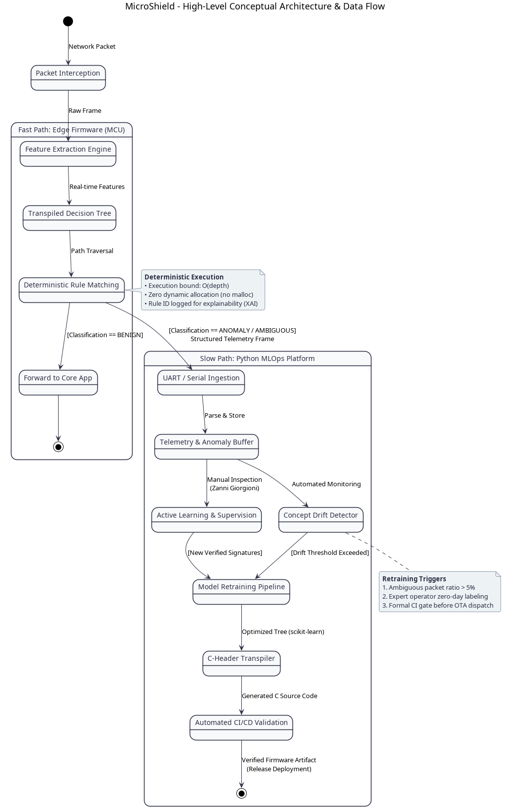

# 1. Concept & Problem Definition

## 1.1 Industrial Context & Emerging Threat Surface

The rapid proliferation of cyber-physical systems, Industrial Internet of Things (IIoT) platforms, and connected edge nodes has fundamentally transformed modern industrial automation. Microcontroller units (MCUs) running bare-metal firmware or lightweight Real-Time Operating Systems (RTOS) are increasingly integrated into networked environments to manage critical functions: factory sensor acquisition, robotics motor actuation, telecommunications gateways, and smart grid substations.

Historically, embedded microcontrollers relied on "security through obscurity" or physical perimeter isolation (air-gapped networks). However, the convergence of Operational Technology (OT) with enterprise Information Technology (IT) networks—driven by Industry 4.0 paradigms—has exposed these constrained endpoints directly to hostile network traffic. Common threat vectors include:
- Volumetric Denial-of-Service (DoS/DDoS) floods targeting low-bandwidth field buses.
- Port scanning, endpoint discovery sweeps, and network enumeration probes.
- Unauthorized protocol commands, register tampering, and malformed payload injection (e.g., Modbus/TCP or MQTT exploit payloads).

Concurrently, European regulatory mandates—most notably the **EU Cyber Resilience Act (CRA)** and the **NIS 2 Directive**—impose strict legal liabilities on equipment manufacturers to guarantee cybersecurity by design throughout the entire device lifecycle, enforcing tamper detection, proactive anomaly monitoring, and auditable vulnerability telemetry.

---

## 1.2 The Problem: Limitations of Conventional IDS on Bare-Metal Silicons

Traditional Intrusion Detection and Prevention Systems (such as Snort, Suricata, Zeek, or eBPF-based host monitors) were architected exclusively for general-purpose computing platforms (x86_64, high-end ARM application processors) equipped with gigabytes of RAM, multi-core CPUs, and rich operating system kernels (Linux/Windows). 

Attempting to adapt these conventional paradigms directly onto resource-constrained microcontrollers introduces fundamental architectural failure modes:

| Dimension | General-Purpose IT IDS | Bare-Metal Industrial Microcontroller | Architectural Conflict |
| :--- | :--- | :--- | :--- |
| **Execution Environment** | Linux / Windows (Virtual Memory & MMU) | Bare-Metal / RTOS (Flat physical memory space) | Lack of an MMU means any pointer corruption crashes the entire physical node. |
| **Memory Allocation** | Dynamic Heap (`malloc`, `free`, hash tables) | Strictly Static Allocation (Zero dynamic heap) | Dynamic allocation causes heap fragmentation, non-deterministic latency, and panic halts. |
| **Timing Constraints** | Best-effort, asynchronous batch processing | Hard Real-Time control loops (1 kHz, sub-millisecond) | Variable-latency packet inspection induces fatal jitter in critical industrial control tasks. |
| **Energy & Power Budget** | High-power server/desktop infrastructure | Milliwatt power budgets, battery or energy-harvested | Heavy computation depletes power reserves and causes thermal throttling. |
| **Model Explainability** | Deep Neural Networks, Black-box ensembles | Direct engineering auditability (Rule ID, XAI) | Regulatory standards mandate verifiable, symbolic justification for all filtering actions. |

---

## 1.3 The MicroShield Proposition

**MicroShield** resolves this architectural mismatch by providing an ultra-compact, deterministic, dual-tier intrusion detection and prevention framework tailored specifically for resource-critical microcontrollers.

The system decouples real-time inline packet inspection from compute-intensive machine learning operations:
1. **Edge Runtime Tier (Embedded C99):** An inline, hardware-agnostic packet inspection engine that executes directly on the microcontroller. By replacing complex pattern matching with statically pre-compiled Decision Trees, the edge runtime evaluates incoming data-link frames in bounded, deterministic time ($O(\text{depth}) \le 50\ \mu\text{s}$) using zero dynamic memory allocation.
2. **Supervisory MLOps Tier (Host Python):** An asynchronous fleet management suite operating on a host workstation or industrial gateway. It monitors telemetry streams dispatched over out-of-band diagnostic channels, computes statistical concept drift, triggers model retraining when network traffic distributions evolve, and automatically transpiles updated estimators into portable C99 header files.

---

## 1.4 High-Level System Workflow

The operational life cycle of MicroShield follows a continuous, closed-loop engineering workflow:

1. **Traffic Interception & Line-Rate Extraction:** The edge engine hooks into the microcontroller's communication peripheral drivers at OSI Layer 2. Inbound frames are captured via direct memory access (DMA) without payload copying.
2. **Deterministic Feature Evaluation:** The engine extracts a compact vector of normalized statistical features (inter-arrival delta, frame length, protocol control flags, payload byte variance) using pre-allocated memory buffers.
3. **Ternary Classification & Gatekeeping:** The feature vector traverses the static decision matrix:
   - `BENIGN`: The frame is released immediately to the core firmware application without latency penalties.
   - `ATTACK`: Downstream processing is suppressed, quarantining the payload from the internal network stack.
   - `AMBIGUOUS`: The frame falls near decision boundaries, indicating potential concept drift or an emerging attack variant.
4. **Out-of-Band Telemetry Staging:** Malicious and ambiguous events are serialized into an isolated transmission ring buffer and transmitted asynchronously via a dedicated UART/USB link, introducing zero communication jitter into the field network.
5. **Supervisory Surveillance & Automated Transpilation:** The host suite ingests telemetry records, assesses rolling ambiguity ratios, alerts operators through an interactive dashboard, and orchestrates model retraining when distribution shifts exceed operational thresholds.

---

## 1.5 Operational Personas

MicroShield is engineered to serve three distinct operational stakeholders across the industrial lifecycle:

### 1.5.1 Persona 1: Zanni Giorgioni (OT Cybersecurity Operations Engineer)
- **Profile:** Cybersecurity analyst responsible for operational resilience, intrusion surveillance, and threat response across industrial manufacturing plants.
- **Key Goals:**
  - Real-time visibility into edge threat landscapes without generating disruptive alert fatigue.
  - Transparent, explainable classification decisions (intrinsic XAI) that identify exact split rules and anomalous feature thresholds.
  - Continuous adaptation against novel zero-day attacks and protocol variations via automated concept drift detection.
- **Interaction with MicroShield:**
  - Monitors the supervisory fleet dashboard to inspect live telemetry streams, anomaly distributions, and confusion matrices.
  - Reviews ambiguous alerts to validate emerging attack signatures and supervises continuous model retraining cycles.

### 1.5.2 Persona 2: Taddeo Pallabà (Senior Embedded Firmware Engineer)
- **Profile:** Low-level C firmware architect responsible for programming sensor acquisition nodes, motor actuators, and real-time control routines running on ARM Cortex-M hardware.
- **Key Goals:**
  - Strict preservation of the primary control loop schedule ($T_{\text{loop}} = 1000\ \mu\text{s}$ at 1 kHz), demanding an IDS inspection overhead that is strictly bounded ($\le 50\ \mu\text{s}$) with near-zero jitter.
  - Total exclusion of dynamic memory allocation (`no malloc`) to safeguard firmware stability against memory exhaustion, heap fragmentation, and unhandled pointer faults.
  - Seamless integration via a modular, statically linkable C library exposing an intuitive, hardware-agnostic API.
- **Interaction with MicroShield:**
  - Statically links `libmicroshield.a` into the embedded firmware build during target compilation.
  - Hooks physical data-link receive buffers (Ethernet MAC or industrial fieldbus transceivers) to the MicroShield ingress handler.
  - Dedicates an isolated physical UART peripheral for diagnostic telemetry offloading to the supervisory station.
  - Ingests updated, transpiled C header files (`transpiled_model.h`) emitted by the supervisory tier across firmware revisions.

### 1.5.3 Persona 3: Lentina Gigi (Industrial Plant & Compliance Director)
- **Profile:** Executive manager responsible for manufacturing uptime, operational safety, and statutory regulatory compliance across factory facilities.
- **Key Goals:**
  - Complete elimination of false-positive plant shutdowns caused by overzealous security filters.
  - Direct compliance with statutory European cybersecurity directives (EU CRA Article 10, NIS 2).
  - Verifiable, tamper-evident forensic audit trails for insurance verification and official regulatory audits.
- **Interaction with MicroShield:**
  - Consumes high-level fleet availability metrics, uptime preservation indicators, and compliance reports.
  - Utilizes cryptographically secured historical incident archives during formal European cybersecurity audit inspections.

---

## 1.6 High-Level Conceptual Architecture

The macro-scale architectural boundaries and component responsibilities separating the Edge Runtime from the Supervisory MLOps Tier are modeled in the diagram below (click image to expand to full resolution):

---

## 1.7 References

- [1] European Commission, "Proposal for a Regulation on horizontal cybersecurity requirements for products with digital elements (Cyber Resilience Act)," COM(2022) 454 final, Brussels, 2022.
- [2] European Parliament and Council of the European Union, "Directive (EU) 2022/2555 on measures for a high common level of cybersecurity across the Union (NIS 2 Directive)," Official Journal of the European Union, L 333, pp. 80–152, 2022.
- [3] I. Sommerville, *Software Engineering*, 10th ed. Boston, MA: Pearson, 2016.
