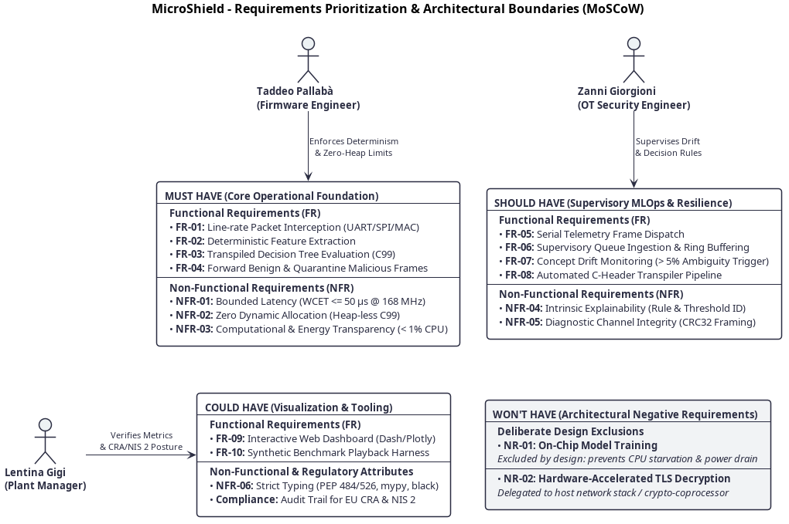

# 2. Requirements Engineering

## 2.1 Problem Domain Boundary & Methodology

In software engineering methodology, requirements analysis formalizes the Problem Domain—the operational conditions, functional capabilities, and behavioral boundaries of the target environment—strictly decoupled from the Solution Domain, which addresses architectural design, data structures, and implementation technologies [1]. 

MicroShield operates at the convergence of three demanding domains:
1. Ultra-Constrained Embedded Computing: Resource-restricted microcontroller units (MCUs) deployed in industrial sensing and control loops.
2. Deterministic Intrusion Detection: Line-rate network anomaly classification operating under hard real-time constraints.
3. Supervisory MLOps & Active Learning: High-level fleet monitoring, telemetry aggregation, and continuous model updating.

To establish verifiable engineering criteria, all requirements are formalized using unique identifiers, active grammatical syntax, and quantifiable metrics.

---

## 2.2 Functional Requirements (FR)

Functional requirements specify the operational capabilities and state transformations that MicroShield must execute.

| Requirement ID | Operational Scope | Requirement Statement | Verification Method |
| :--- | :--- | :--- | :--- |
| FR-01 | Edge Runtime | The system shall intercept inbound network communication frames at the physical/data-link interface (UART, SPI, Ethernet MAC) before passing payload data to the core firmware application. | Hardware loopback stimulus and frame capture test. |
| FR-02 | Edge Runtime | The system shall extract normalized statistical features (frame length, inter-arrival time delta, protocol control flags, payload byte variance) using statically pre-allocated memory buffers. | Unit test with synthetic packet injection comparing extracted vectors. |
| FR-03 | Edge Runtime | The system shall evaluate the extracted feature vector against a pre-compiled decision logic model and classify the frame into a ternary state: BENIGN, ATTACK, or AMBIGUOUS. | Matrix validation against ground-truth labeled test vectors. |
| FR-04 | Edge Runtime | The system shall forward BENIGN frames to the core application without modification and quarantine ATTACK frames by suppressing downstream processing. | End-to-end integration test observing core application input queue. |
| FR-05 | Supervisory Tier | Upon intercepting an ATTACK or AMBIGUOUS frame, the edge engine shall construct a structured telemetry frame and dispatch it over a dedicated diagnostic serial channel. | Serial packet sniffer verifying packet framing, metadata, and timestamps. |
| FR-06 | Supervisory Tier | The Python supervisory suite shall ingest incoming serial telemetry records, parse anomaly metadata, and buffer samples in a circular FIFO queue. | Automated test suite verifying buffer ingestion rates under load. |
| FR-07 | Supervisory Tier | The supervisory suite shall compute the rolling ambiguity ratio over a configurable window and trigger a concept drift alert when ambiguous classifications exceed 5% of total events. | Simulated statistical drift injection and assertion of trigger events. |
| FR-08 | Supervisory Tier | The system shall transpile a trained and pruned Decision Tree model (scikit-learn) into a standalone, portable C99 header containing static decision lookup matrices. | Automated build check verifying valid C99 syntax, compilation, and equivalent inference outputs. |
| FR-09 | Supervisory Tier | The system shall provide an interactive web dashboard (Dash/Plotly) displaying live telemetry charts, confusion matrices, and model performance metrics. | Browser-based user interface validation test. |
| FR-10 | Validation Testbench | The system shall include an automated traffic playback engine capable of streaming benchmark network flows (Bot-IoT [2] and Edge-IIoTset [3]) to the hardware device under test. | CI pipeline execution measuring classification accuracy against ground truth. |

---

## 2.3 Non-Functional Requirements (NFR) & Quality Attributes

Non-functional requirements define the operational qualities, performance bounds, and safety attributes of the system, governed by the principle of computational and energy transparency:

  <i>&Delta;t</i>IDS &ll; <i>T</i>loop 
  &emsp;&emsp;<b>&amp;</b>&emsp;&emsp; 
  <i>E</i>IDS &ll; <i>E</i>core

Where Δt_IDS represents the worst-case inspection latency, T_loop denotes the period of the primary sensing and actuation loop, E_IDS is the energy consumed per packet inspection, and E_core is the operational power budget of the primary application.

| Requirement ID | Quality Attribute | Quantitative Metric & Deterministic Bound | Verification Method |
| :--- | :--- | :--- | :--- |
| NFR-01 | Real-Time Latency | Worst-Case Execution Time (WCET) bounded by O(depth). Total per-packet inspection time <= 50 µs on ARM Cortex-M4 at 168 MHz; jitter introduced into core loop < 5%. | Hardware DWT cycle counter profiling and oscilloscope GPIO toggling. |
| NFR-02 | Ultra-Low-Power | 100% interrupt-driven execution (zero active polling loops). Preservation of deep sleep states (Sleep/Stop). Traversal budget <= 500 CPU cycles; energy overhead < 1% of node power budget. | Current shunt measurement with digital storage oscilloscope across low-power transitions. |
| NFR-03 | Heapless Memory | Zero dynamic heap allocation (malloc, calloc, free prohibited). Flash memory footprint <= 16 KB; Static RAM (SRAM) <= 4 KB. Compliance with MISRA C:2012 safety guidelines. | Linker map file analysis and static analysis with gcc flags (-Wstack-usage, -Wbad-function-cast). |
| NFR-04 | Intrinsic XAI | Output of deterministic Rule ID and split feature index for every leaf decision. Complete exclusion of black-box opaque models. | Unit tests asserting returned Rule IDs against offline decision tree traversal traces. |
| NFR-05 | Telemetry Security | Out-of-band serial telemetry frames protected via CRC32 frame checksum to guarantee diagnostic data integrity against line noise or tampering. | Fault-injection testing introducing corrupted serial frames and asserting frame rejection. |
| NFR-06 | Code Quality | Python supervisory suite strictly typed under PEP 484 and PEP 526 validated via mypy; documentation matching PEP 257; linting with black and flake8. | Automated CI pipeline gate enforcing zero type errors and zero linter warnings. |

---

## 2.4 Domain Constraints & Regulatory Frameworks

The system architecture is strictly governed by industrial hardware realities and binding European regulatory statutes:

### 2.4.1 Hardware Architectural Constraints
- Processor Architecture: Target platform is the ARM Cortex-M4 core (specifically STMicroelectronics STM32F407VGT6 on the Nucleo-F407RE development board) operating at 168 MHz with 192 KB of SRAM and 1024 KB of Flash.
- Absence of Memory Management Unit (MMU): The hardware core does not support virtual memory translation or process isolation paging. Memory protection relies entirely on static compilation boundaries and optional hardware Memory Protection Unit (MPU) configurations.

### 2.4.2 Regulatory Compliance Directives
- EU Cyber Resilience Act (CRA): Requires hardware and software products introduced to the EU market to exhibit security by design throughout their operational lifecycle [4]. MicroShield satisfies CRA Article 10 mandates by providing on-device active packet filtering, tamper detection, and auditable vulnerability telemetry.
- Directive (EU) 2022/2555 (NIS 2): Mandates rigorous operational resilience and incident reporting capabilities for critical infrastructure [5]. MicroShield facilitates compliance by generating cryptographically consistent security audit logs for forensic event reconstruction.

---

## 2.5 MoSCoW Prioritization & Deliberate Architectural Exclusions

To balance operational completeness with the project delivery timeframe (100–110 engineering hours), requirements are prioritized according to the MoSCoW methodology:

| Category | Requirement IDs | Core Rationale & Scope Definition |
| :--- | :--- | :--- |
| Must Have | FR-01, FR-02, FR-03, FR-04, NFR-01, NFR-02, NFR-03 | Fundamental operating core: deterministic, heapless C99 packet inspection running transparently on ARM Cortex-M hardware. |
| Should Have | FR-05, FR-06, FR-07, FR-08, NFR-04, NFR-05 | Supervisory intelligence: automated AST transpiler, serial telemetry ingestion, concept drift detection, and explainability. |
| Could Have | FR-09, FR-10, NFR-06 | Tooling and visualization: interactive Dash/Plotly dashboard and automated benchmark playback harness. |
| Won't Have | NR-01, NR-02 | Deliberate architectural exclusions (Negative Requirements). |

### Architectural Negative Requirements (Won't Have)

In formal systems engineering, defining what a system must not do is as critical as defining its functional capabilities:

* NR-01: On-Chip Model Training (Deliberately Excluded):
  * Architectural Rationale: Training machine learning models involves computing recursive information gain, entropy matrices, or gradient descent steps. Executing training routines on an ARM Cortex-M4 microcontroller would saturate the CPU, consume significant power, and disrupt real-time control loops, violating the core principle of energy transparency (E_IDS << E_core). Training and optimization belong strictly in the supervisory MLOps tier.
* NR-02: Hardware-Accelerated TLS Payload Decryption (Deliberately Excluded):
  * Architectural Rationale: Transport layer decryption is the exclusive responsibility of the application network stack or dedicated cryptographic co-processors. MicroShield focuses on statistical protocol metadata, packet rates, frame sizes, and unencrypted industrial headers (e.g., Modbus/TCP, MQTT, raw telemetry). Performing full TLS termination within the IDS engine would introduce unviable latency jitter and memory allocation overhead.

---

## 2.6 Requirements Traceability & Visual Hierarchy

The relationship between the formalized requirements, the MoSCoW classification boundaries, and the target operational personas is mapped in the following architectural model (click image to open full resolution):

### Persona Mapping & Operational Requirement Alignment

To ensure traceability from stakeholder objectives to technical implementation, each operational persona is mapped to their governing requirements:

| Target Persona | Operational Role & Context | Aligned MoSCoW Tier | Enforced Requirements | Impact on System Operation |
| :--- | :--- | :--- | :--- | :--- |
| **Taddeo Pallabà** | Senior Embedded Firmware Engineer | **MUST HAVE** | FR-01, FR-02, FR-03, FR-04, NFR-01, NFR-02, NFR-03 | Guarantees hard real-time execution bounds (<= 50 µs), static memory boundaries (no malloc), and zero jitter on critical industrial control loops. |
| **Zanni Giorgioni** | OT Cybersecurity Operations Engineer | **SHOULD HAVE** | FR-05, FR-06, FR-07, FR-08, NFR-04, NFR-05 | Provides transparent incident explainability (Rule IDs), automated concept drift surveillance (> 5%), and secure diagnostic telemetry. |
| **Lentina Gigi** | Industrial Plant & Compliance Director | **COULD HAVE** & Regulatory | FR-09, FR-10, NFR-06, CRA, NIS 2 | Delivers high-level operational dashboards, empirical benchmark verification, and certified audit trails for regulatory compliance. |

---

## 2.7 References

- [1] I. Sommerville, Software Engineering, 10th ed. Boston, MA: Pearson, 2016.
- [2] N. Koroniotis, N. Moustafa, E. Sitnikova, and B. Turnbull, "Towards the Development of Realistic Botnet Dataset in the Internet of Things for Network Forensic Analytics: Bot-IoT Dataset," Future Generation Computer Systems, vol. 100, pp. 779–796, 2019.
- [3] M. A. Ferrag, O. Friha, D. Hamouda, L. Maglaras, and H. Janicke, "Edge-IIoTset: A New Comprehensive Realistic Cyber Security Dataset of IoT and IIoT Applications for Centralized and Federated Learning," IEEE Access, vol. 10, pp. 40281–40306, 2022.
- [4] European Commission, "Proposal for a Regulation on horizontal cybersecurity requirements for products with digital elements (Cyber Resilience Act)," COM(2022) 454 final, Brussels, 2022.
- [5] European Parliament and Council of the European Union, "Directive (EU) 2022/2555 on measures for a high common level of cybersecurity across the Union (NIS 2 Directive)," Official Journal of the European Union, L 333, pp. 80–152, 2022.
