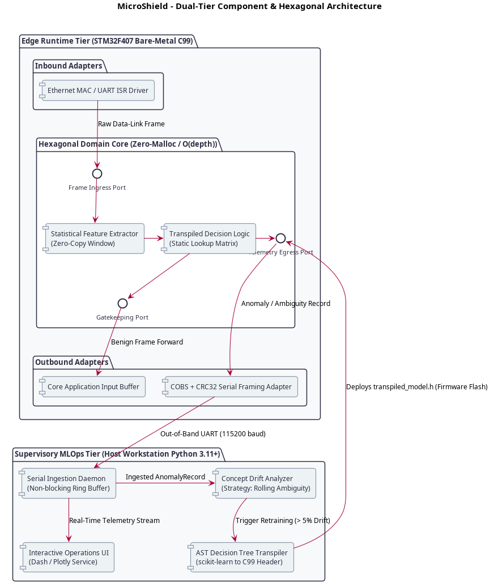
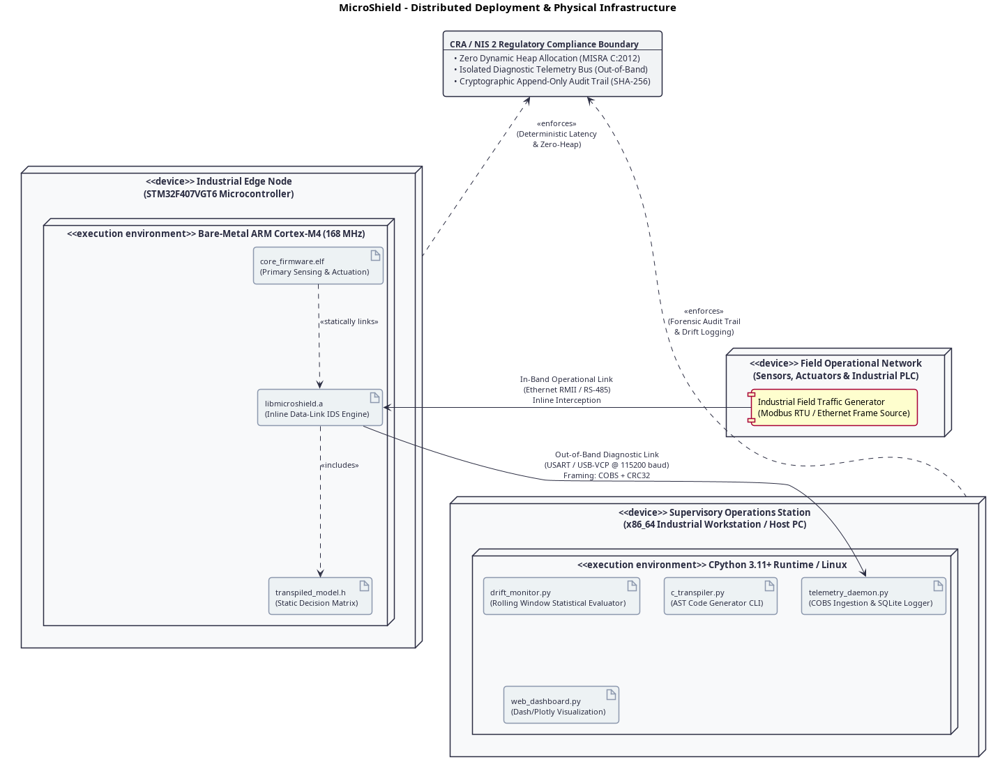
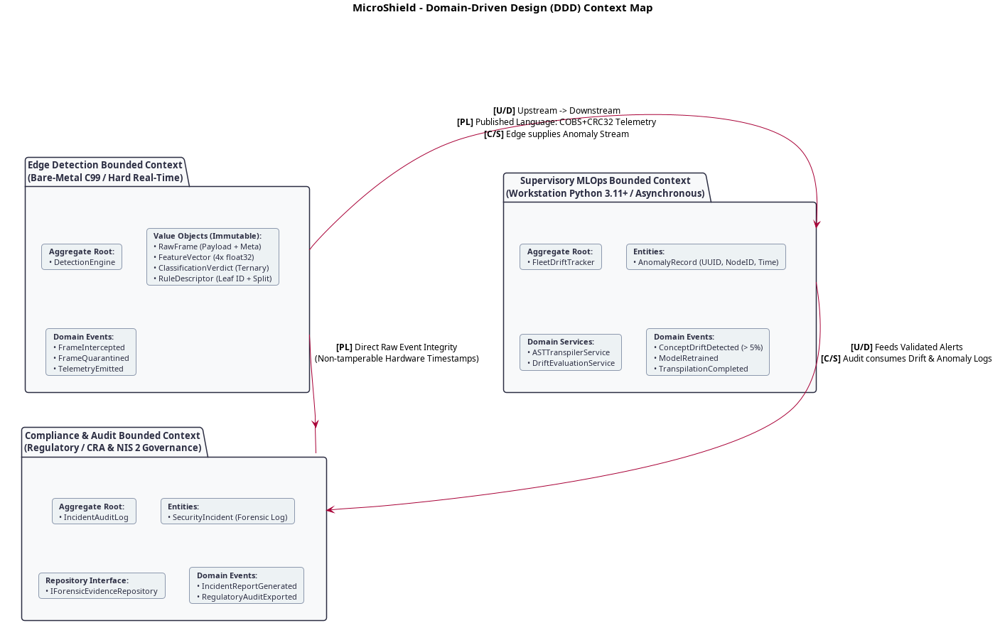
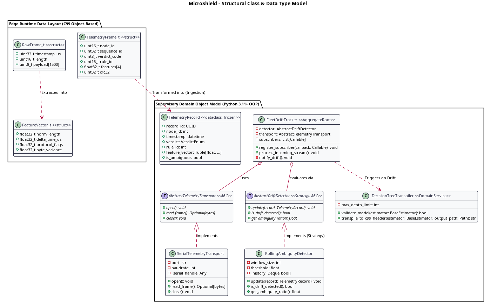
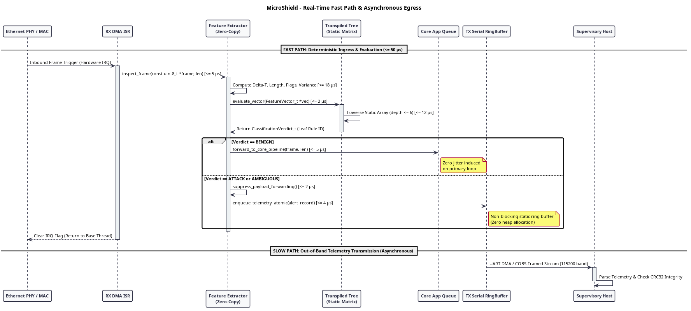
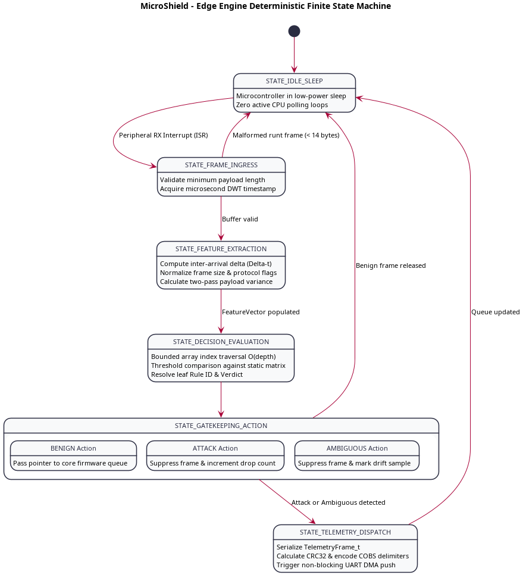
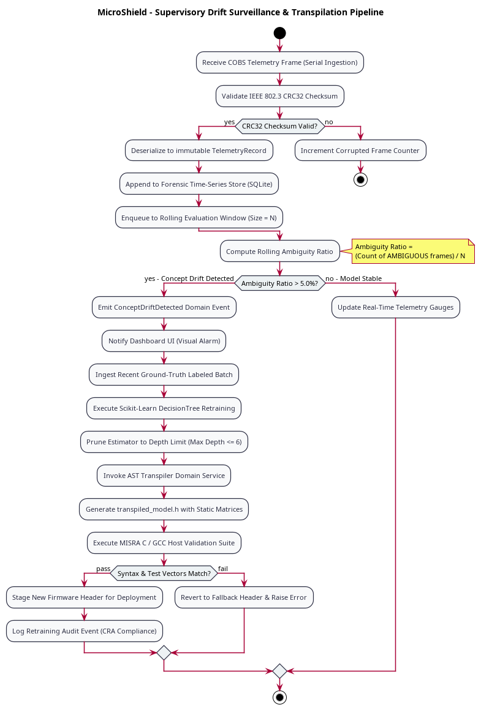

# 3. Architectural & Detailed Design

## 3.1 Architectural Style & Component Decoupling

The design phase formalizes the Solution Domain—the structural, behavioral, and infrastructural patterns chosen to satisfy the operational constraints established during requirements engineering—while maintaining deliberate independence from low-level implementation libraries [1].

MicroShield partitions operational responsibilities across two fundamentally distinct environments: a hard real-time, resource-constrained bare-metal microcontroller unit (Edge Tier) and an asynchronous supervisory telemetry workstation (Supervisory MLOps Tier).

### 3.1.1 Evaluation of Candidate Architectural Styles

To establish an optimal architectural pattern, four classical software paradigms were systematically evaluated against the system's operational constraints:

| Architectural Style | Theoretical Foundation & Mechanics | Suitability for Edge Runtime | Rejection Rationale & Technical Failure Modes |
| :--- | :--- | :--- | :--- |
| Strictly Layered | Components are organized hierarchically; requests traverse contiguous abstraction layers sequentially (Hardware -> Driver -> Protocol -> Security -> Application). | Rejected | Introduces deep function-call invocation chains. On an ARM Cortex-M4, every intermediate layer traversal incurs stack pointer adjustments, register spills (push/pop of R0-R3, R12, LR), and pipeline stalls, violating the strict sub-50 µs latency budget (NFR-01). |
| Shared Dataspace (Blackboard / Tuple Space) | Decoupled components communicate exclusively by writing, reading, and consuming structured tuples from a centralized, concurrent memory pool (e.g., Linda model) [1]. | Rejected | Requires mutual exclusion primitives (mutexes, spinlocks, or semaphores). On a bare-metal microcontroller without an RTOS, shared-memory locking introduces severe priority inversion risks (as demonstrated historically in the Mars Pathfinder incident) and non-deterministic execution times, while violating the zero-dynamic-allocation mandate (NFR-03). |
| Microkernel (Plug-in Architecture) | A minimal core executes basic hardware mediation while extended capabilities are loaded dynamically as modular shared libraries or drivers. | Rejected | Relies on dynamic linking, relocation tables, and virtual memory page mapping, mechanisms unavailable on ARM Cortex-M microcontrollers lacking a Memory Management Unit (MMU). |
| Hexagonal (Ports & Adapters) + Event-Driven Pipeline | The algorithmic domain logic is isolated at the center of an abstraction boundary (Hexagon) communicating via abstract interfaces (Ports); concrete hardware peripherals interact via boundary drivers (Adapters). | Adopted | The pure C99 detection logic remains entirely decoupled from target microcontroller registers. Enables automated desktop host testing via POSIX mocks and native compilation on bare-metal hardware without modifying a single line of classification code. |

### 3.1.2 The Edge Hexagonal Architecture (Ports & Adapters)

At the Edge Runtime Tier, MicroShield implements Cockburn's Hexagonal Architecture pattern [2] to enforce complete decoupling between safety-critical detection logic and underlying silicon hardware. 

The algorithmic core resides inside an isolated logical boundary, communicating with external hardware peripherals strictly through abstract contractual interfaces (Ports) implemented by concrete device drivers (Adapters):

- Hexagonal Domain Core: Contains strictly deterministic, portable C99 algorithmic logic. It performs windowed statistical feature extraction and traverses pre-compiled decision tree matrices. The core possesses zero awareness of hardware registers, STMicroelectronics Hardware Abstraction Layer (HAL) definitions, or low-level timer peripherals.
- Frame Ingress Port: A formal interface through which incoming data-link frames are injected into the detection pipeline via static memory pointers.
- Gatekeeping Port: An outbound contractual interface that signals the core industrial firmware application whether an intercepted frame is benign (forwarded immediately) or malicious (quarantined and dropped).
- Telemetry Egress Port: An outbound interface that offloads anomaly descriptors to diagnostic serial buffers without blocking the primary execution thread.

### 3.1.3 Supervisory Event-Driven Pipeline Architecture

On the host workstation, the supervisory tier is structured as an asynchronous, event-driven data processing pipeline. Incoming diagnostic frames arriving over the serial telemetry bus generate discrete domain events that propagate through four decoupled stages:
- Serial Ingestion Daemon: Manages non-blocking character reading from the operating system virtual COM port (VCP), reconstructs framed packets, and enqueues parsed payloads into an in-memory ring buffer.
- Concept Drift Analyzer: Subscribes to the ingestion queue and computes statistical ambiguity distributions across sliding temporal windows using a pluggable Strategy pattern.
- AST Decision Tree Transpiler: A model compiler that consumes scikit-learn tree graphs, evaluates leaf node distributions, and emits optimized, MISRA-compliant C99 header files.
- Interactive Operations UI: A reactive web service built with Dash and Plotly that streams network flow analytics, confusion matrices, and audit logs to operations personnel.

### 3.1.4 Component Decomposition & Architectural Responsibilities

The functional boundaries and interaction points between the edge and supervisory tiers are illustrated in the component model below (click image to expand to full resolution):

### Architectural Responsibilities by Component:

| Component Identifier | Hosting Tier | Primary Engineering Responsibility | Interface Contract & Coupling |
| :--- | :--- | :--- | :--- |
| Statistical Feature Extractor | Edge Runtime (C99) | Calculates normalized length, inter-arrival time delta, protocol control flags, and payload byte variance across a statically allocated sliding history. | Coupled only to static frame buffers; zero library dependencies. |
| Transpiled Decision Logic | Edge Runtime (C99) | Evaluates the extracted feature vector via static lookup arrays; returns ternary state (BENIGN, ATTACK, AMBIGUOUS) in bounded O(depth) time. | Strictly constant-time traversal; consumes transpiled_model.h. |
| COBS Framing Adapter | Edge Runtime (C99) | Encodes diagnostic alert structures using Consistent Overhead Byte Stuffing and computes CRC32 checksums for physical serial transmission. | Operates over dedicated DMA-backed circular transmission buffers. |
| Serial Ingestion Daemon | Supervisory (Python) | Deserializes incoming byte streams, verifies CRC32 integrity, and populates immutable AnomalyRecord instances. | Non-blocking OS serial interface; producer for the telemetry queue. |
| Concept Drift Analyzer | Supervisory (Python) | Evaluates rolling ambiguity ratios; triggers a drift alert when ambiguous classifications exceed the 5% threshold. | Implements AbstractDriftDetector Strategy interface. |
| AST Model Transpiler | Supervisory (Python) | Generates static C99 decision lookup arrays and rule boundaries from trained Python estimators. | Consumes DecisionTreeClassifier; outputs valid C header syntax. |
| Interactive Dashboard | Supervisory (Python) | Visualizes telemetry streams, alerts, and system health in a multi-page web browser interface. | Consumes SQLite event repository; isolated from serial ingestion thread. |

### 3.1.5 Intrinsic Explainable AI (XAI) Architecture

Unlike black-box machine learning approaches (deep neural networks, support vector machines, or ensemble forests) that require complex, compute-intensive post-hoc explanation frameworks (such as LIME or SHAP), MicroShield delivers native, zero-cost **Intrinsic Explainable AI (XAI)**:
- **On-Chip Symbolic Attribution:** Each leaf node in the transpiled C99 decision tree is assigned an immutable 16-bit integer identifier (`rule_id`). When the inference engine reaches a terminal leaf, it captures the `rule_id` and the primary feature index responsible for the terminal branch split. This metadata is packed directly into the diagnostic telemetry frame with zero computational overhead.
- **Supervisory Semantic Decoding:** The Python transpiler generates a companion semantic metadata registry (`rule_dictionary.json`). When the supervisory dashboard receives an anomaly event with `rule_id = 14`, it maps the identifier directly to human-readable symbolic logic (e.g., `"Flagged as ATTACK: byte_variance > 0.45 AND delta_time_us < 120 (Volumetric Flood Pattern)"`). This provides Zanni Giorgioni with instant, deterministic auditability for every automated filtering action without inducing any latency on the microcontroller.

---

## 3.2 Distributed Infrastructure & Communication Topologies

MicroShield operates across a physically distributed, heterogeneous topology connecting real-time industrial edge nodes with supervisory workstations.

### 3.2.1 High-Level Central-Star Diagnostic Topology

At the highest level of abstraction, the system establishes a **Central-Star Diagnostic Architecture**. While industrial field devices participate in diverse operational network topologies (such as peer-to-peer wireless meshes among mobile robots, linear multidrop RS-485 factory buses, or redundant industrial Ethernet rings), each MicroShield-enabled node maintains a dedicated, out-of-band diagnostic link routed directly to the supervisory management station.

This decoupled star topology ensures that diagnostic telemetry traffic generated during severe cyberattack incidents cannot saturate, degrade, or introduce communication jitter into the operational control network.

### 3.2.2 Execution Environments & Hardware Allocation

The physical allocation of computational tasks is partitioned across two target environments:

1. Edge Node Platform (STMicroelectronics STM32F407VGT6):
   - Core Architecture: ARM Cortex-M4 32-bit RISC core with Hardware Floating Point Unit (Single-Precision FPU).
   - Clock Frequency: 168 MHz (delivering up to 210 DMIPS / 1.25 DMIPS/MHz).
   - Memory Mapping: 1024 KB on-chip non-volatile Flash memory for instructions and constant lookup tables; 192 KB contiguous Static RAM (112 KB System SRAM, 16 KB Auxiliary SRAM, 64 KB Core Coupled Memory - CCM Data RAM).
   - Hardware Isolation: CCM RAM is utilized specifically for the IDS feature calculation workspace, completely bypassing the shared multi-layer AHB bus matrix to eliminate contention with CPU instruction fetching and direct memory access (DMA) transfers.
2. Supervisory Station Platform (Industrial Workstation / Server):
   - Processor Architecture: x86-64 multi-core processor running modern Linux distributions.
   - Execution Environment: CPython 3.11+ runtime leveraging native vectorized math libraries (NumPy, SciPy) and parallel dashboard request handling.

### 3.2.3 Selection of Edge Diagnostic Physical Interface

The selection of the physical diagnostic link between the edge microcontroller and the supervisory station is governed by cabling distance, protocol autonomy, and noise immunity. 

Among the integrated communication peripherals of the STM32F407:
- **I2C was rejected** due to its strict master/slave architecture—which prevents the microcontroller from asynchronously pushing emergency alert frames without continuous host polling—as well as its high susceptibility to capacitive bus loading and industrial electromagnetic interference over distances exceeding one meter.
- **SPI was rejected** due to excessive cabling overhead (requiring independent Chip Select routing per node in multidrop configurations) and its master-clocked topology, which violates autonomous edge alert dispatching.
- **UART / USART was adopted:** Operating asynchronously in full-duplex mode, UART allows the microcontroller to initiate diagnostic frame transfers autonomously via internal peripheral interrupts and DMA channels. Furthermore, UART interfaces readily translate to USB Virtual COM Ports (VCP) for local testbench workstations, differential RS-485 transceivers for long-span factory floors, or wireless bridge modules (such as industrial BLE, LoRaWAN, or cellular modems) without modifying the edge software driver.

### 3.2.4 Open Systems Interconnection (OSI) Stack Placement

To ensure universal compatibility across diverse industrial applications, MicroShield positions its packet inspection boundary strictly at OSI Layer 2 (Data-Link Layer), interposing directly between physical layer transceivers and host network stacks:

| OSI Layer | Protocol Examples in Scope | MicroShield Operational Role & Boundary |
| :--- | :--- | :--- |
| Layer 7 - Application | Modbus/TCP, MQTT, CoAP, DNP3, CIP | Consumed by core application firmware; unparsed by MicroShield to avoid deep payload inspection overhead. |
| Layer 4 - Transport | TCP, UDP | Header parsing bypassed; transport behavior observed indirectly through statistical flow properties. |
| Layer 3 - Network | IPv4, IPv6, 6LoWPAN | IP header lengths and address variation evaluated via lightweight statistical extraction. |
| Layer 2 - Data-Link | Ethernet MAC, CAN Frame, SLIP/COBS | INLINE BUMP-IN-THE-WIRE INSPECTION BOUNDARY: Real-time feature calculation and ternary decision tree classification. |
| Layer 1 - Physical | 10/100 Ethernet PHY (RMII), RS-485 | Hardware signal acquisition via dedicated peripheral interrupt service routines (ISRs). |

- Bump-in-the-Wire Rationale: By intercepting inbound frames directly from the physical layer controller (PHY/MAC) before parsing by higher-level software network stacks (e.g., LwIP), MicroShield protects the node against low-level resource exhaustion attacks, packet malformation exploits, and transport layer denial-of-service floods.
- Protocol Agnosticism: Operating at Layer 2 enables the statistical feature extractor to derive universal behavioral metrics (frame length distributions, burstiness, inter-arrival intervals) regardless of whether the encapsulated payload is unencrypted Modbus, MQTT, or an encrypted TLS tunnel.

### 3.2.5 Physical Framing & Data Integrity Protocol (COBS + CRC32)

Serial diagnostic links are asynchronous byte streams lacking native frame delimiters. To guarantee unambiguous frame boundary reconstruction without risking data corruption, MicroShield implements Consistent Overhead Byte Stuffing (COBS) paired with a trailing Cyclic Redundancy Check (CRC32):

1. Delimiter Independence: A null byte (0x00) is reserved exclusively as the end-of-frame packet delimiter.
2. Deterministic Overhead: COBS encodes payload bytes such that null bytes appearing within the actual telemetry record are eliminated through pointer substitution, guaranteeing an overhead bounded by at most 1 byte per 254 bytes of payload.
3. Transmission Validation: Every telemetry frame concludes with an IEEE 802.3 compliant 32-bit CRC. The supervisory ingestion daemon validates the checksum prior to allocating domain entity objects, dropping corrupted frames caused by industrial line noise.

### 3.2.6 Deployment Topography & Regulatory Security Boundaries

The physical deployment topology, bus routing, and regulatory security perimeters mandated by the EU Cyber Resilience Act (CRA) and NIS 2 Directive are modeled in the deployment diagram below (click image to expand to full resolution):

### 3.2.7 Architectural Scalability: Transitioning to Horizontally Scaled Infrastructure

While the experimental validation testbench executes the supervisory suite on a single workstation, the underlying architecture is deliberately decoupled to support enterprise-grade horizontal scaling across industrial plants:
- Broker-Mediated Fleet Ingestion: The point-to-point serial link between field nodes and the supervisory station can be replaced transparently by industrial IoT edge gateways running MQTT, Kafka, or Zenoh brokers. The Python SerialIngestionDaemon conforms to an abstract transport interface (AbstractTelemetryTransport), allowing substitution with a DistributedBrokerTransport without modifying downstream drift analysis or retraining pipelines.
- Stateless Analytics Workers: The ConceptDriftAnalyzer maintains state only across configurable sliding temporal windows. In a multi-plant deployment, multiple worker processes can be orchestrated across container clusters (e.g., Kubernetes) to process partition-sharded telemetry from thousands of field nodes concurrently.
- Centralized Model Registry: Re-transpiled C99 decision headers can be committed directly to a GitOps repository or firmware over-the-air (FOTA) distribution server, enabling automated canary updates across the entire device fleet.

---

## 3.3 Domain-Driven Design (DDD) Modelling

To prevent domain logic corruption and manage cognitive complexity across the edge-to-cloud spectrum, MicroShield strictly applies the principles of Domain-Driven Design (DDD) [3]. The Problem Domain is segregated into three autonomous Bounded Contexts, each characterized by a unified Ubiquitous Language, explicit boundary contracts, and tailored data models.

### 3.3.1 Bounded Context Formalization & Ubiquitous Language

The system segregates operational responsibilities across three autonomous contexts:

| Bounded Context | Governing Persona | Operational Boundary & Purpose | Ubiquitous Vocabulary |
| :--- | :--- | :--- | :--- |
| Edge Detection Context | Taddeo Pallabà (Firmware Engineer) | Hard real-time packet interception, feature normalization, and deterministic ternary inference executed bare-metal on the microcontroller. | RawFrame, FeatureVector, ClassificationVerdict, RuleDescriptor, RingBuffer, StaticLookupMatrix. |
| Supervisory MLOps Context | Zanni Giorgioni (OT Security Engineer) | Telemetry stream ingestion, sliding-window statistical drift tracking, model retraining triggers, and automated C99 code generation. | AnomalyRecord, AmbiguityRatio, ConceptDrift, RollingWindow, TranspilationPipeline, ASTNode. |
| Compliance & Audit Context | Lentina Gigi (Plant Manager) | Forensic logging, incident reconstruction, uptime preservation monitoring, and automated generation of CRA/NIS 2 regulatory compliance evidence. | AuditTrail, ForensicEvidence, NonRepudiationHash, IncidentReport, CRAArticle10Compliance. |

### 3.3.2 Domain Concepts & Structural Classification

Within each bounded context, structural concepts are classified strictly into Value Objects, Entities, Aggregate Roots, Domain Events, and Domain Services:

#### 1. Edge Detection Context (Bare-Metal C99)
- Value Objects (Immutable by definition):
  - RawFrame: A contiguous byte array representing an intercepted data-link packet, encapsulated with a hardware microsecond timestamp and length descriptor. Lacks identity; two identical frames are computationally interchangeable.
  - FeatureVector: A 128-bit statically allocated struct containing four normalized single-precision floating-point metrics (norm_length, delta_time_us, protocol_flags, byte_variance).
  - ClassificationVerdict: An immutable ternary enumeration (BENIGN = 0, ATTACK = 1, AMBIGUOUS = 2).
  - RuleDescriptor: A lightweight compound identifier exporting the active decision tree leaf ID and the specific feature index responsible for the split.
- Aggregate Root:
  - DetectionEngine: The operational gatekeeper. It encapsulates the static circular reception buffers, orchestrates the atomic state transition of intercepted frames (quarantined vs. forwarded), and exposes strict public API boundaries preventing external corruption of internal lookup matrices.
- Domain Events:
  - FrameIntercepted: Published when a complete frame is loaded into the DMA reception buffer.
  - FrameQuarantined: Emitted when an anomaly is verified, triggering immediate payload suppression.
  - TelemetryEmitted: Generated when an attack or ambiguous classification is queued for serial transmission.

#### 2. Supervisory MLOps Context (Python 3.11+)
- Entities (Identity-driven):
  - AnomalyRecord: Represents an intercepted anomalous event. Even if two records share identical feature vectors, they maintain distinct operational identities defined by an immutable UUID, a high-resolution UTC timestamp, and the physical NodeID.
- Aggregate Root:
  - FleetDriftTracker: Governs the sliding temporal history of received classifications. It maintains consistency across rolling ambiguity evaluations and enforces the state transitions of the retraining trigger.
- Domain Services:
  - ASTTranspilerService: A stateless domain service that consumes trained scikit-learn tree estimators, validates depth constraints against the worst-case execution time (WCET) budget, and emits portable C99 header files.
  - DriftEvaluationService: Executes rolling statistical hypothesis testing to detect concept drift without altering the telemetry storage state.
- Domain Events:
  - ConceptDriftDetected: Published when ambiguous decisions exceed the 5% threshold over the evaluation window.
  - ModelRetrained: Emitted following offline supervised estimator convergence.
  - TranspilationCompleted: Signifies that a new transpiled_model.h has been validated and staged for firmware deployment.

#### 3. Compliance & Audit Context (Regulatory)
- Entities & Repositories:
  - SecurityIncident: An immutable forensic audit entity capturing incident telemetry paired with a cryptographic SHA-256 integrity hash.
  - IForensicEvidenceRepository: An abstract persistence repository providing append-only guarantees for statutory compliance under the EU Cyber Resilience Act (CRA) Article 10 and NIS 2 Directive.
- Domain Events:
  - CRAIncidentReported: Triggered when high-severity malicious anomalies require formal European vulnerability registry notifications.

### 3.3.3 Context Map & Contractual Relationships

The relationships, boundary governance, and integration patterns between the bounded contexts are formally modeled in the Context Map below (click image to expand to full resolution):

- Upstream/Downstream & Customer/Supplier (Edge -> MLOps): The Edge Detection Context acts as an Upstream (U) supplier delivering raw telemetry frames to the Downstream (D) Supervisory MLOps Context. The supervisory suite functions as a customer, establishing processing SLAs without possessing authority to alter edge timing contracts.
- Published Language (PL): Integration between the bare-metal C99 runtime and the Python supervisory tier is mediated exclusively through a Published Language: the COBS + CRC32 Serial Telemetry Protocol. Neither context exposes internal memory pointers or runtime objects across the physical serial boundary.
- Audit Downstream Ingestion: The Compliance & Audit Context consumes validated alerts from both upstream contexts, enforcing non-repudiation and append-only constraints on incident logs.

---

## 3.4 Structural & Object-Oriented Modelling

To satisfy academic software engineering criteria and ensure code maintainability, the system establishes a clean separation between high-level object-oriented design on the supervisory workstation and deterministic object-based data layouts on the embedded microcontroller.

### 3.4.1 Supervisory Tier Object-Oriented Architecture (Python 3.11+)

The supervisory ecosystem is structured around pure object-oriented design patterns, leveraging Python's abc module for abstract base classes, frozen dataclasses for domain value objects, and strict static typing (PEP 484, PEP 526):

- Strategy Pattern (Algorithmic Drift Detection):
  The interface AbstractDriftDetector defines the abstract contract update(record: TelemetryRecord) -> None and is_drift_detected() -> bool. The concrete class RollingAmbiguityDetector implements the baseline sliding-window ratio. This pattern permits seamless algorithmic substitution (e.g., swapping to ADWIN, Page-Hinkley, or Kolmogorov-Smirnov statistical tests) without modifying the ingestion orchestrator or the dashboard presentation layer.
- Observer Pattern (Reactive Event Dispatch):
  The FleetDriftTracker aggregate root maintains an internal subscriber registry. When an incoming telemetry frame triggers a ConceptDriftDetected event, all registered observers (the Dash live visualizer, the SQLite forensic logger, and the automated transpilation pipeline) are notified asynchronously without tight coupling.
- Immutable Domain Transfer Objects:
  Incoming serial payloads are deserialized directly into immutable TelemetryRecord dataclasses (frozen=True). This guarantees thread safety across concurrent dashboard rendering and drift calculation routines, preventing subtle state corruption bugs.
- Visitor Pattern (AST Code Transpiler):
  The DecisionTreeTranspiler traverses the underlying binary decision tree structure (tree_.children_left, tree_.children_right, tree_.threshold) emitted by scikit-learn. It converts the hierarchical estimator graph into constant C99 array initializers without coupling model validation logic to C syntax generation.

### 3.4.2 Edge Runtime Object-Based Architecture (C99 Bare-Metal)

On the STM32F407 microcontroller, object-oriented concepts are realized using Object-Based C99 idioms optimized for single-cycle execution and deterministic memory alignment:
- Encapsulation via Header Modularity: Private internal variables (ring buffer pointers, threshold tables) are marked static within the implementation translation unit (microshield_engine.c). External callers interact exclusively through opaque function signatures defined in microshield_engine.h.
- Elimination of Virtual Tables (vptrs): Dynamic dispatch (function pointers inside structs) is deliberately excluded from the real-time fast path. In ARM Cortex-M4 architectures, indirect function calls through vtables disrupt instruction prefetching, introduce branch misprediction latency, and consume additional SRAM for pointer tables. All classification calls are resolved at link-time as direct relative branches (BL instructions).
- Structure Padding & Cache Alignment: Memory structs (RawFrame_t, FeatureVector_t, TelemetryFrame_t) are explicitly designed with natural 32-bit alignment (4-byte boundaries). This eliminates compiler-induced structure padding overhead and prevents unaligned memory access penalties on the ARM Cortex-M bus interface.

### 3.4.3 Unified Structural Class Model

The complete structural organization, interface contracts, and relationships bridging the Python supervisory hierarchy and the C99 memory layout are detailed in the class diagram below (click image to expand to full resolution):

### 3.4.4 Distributed Mapping of Domain Concepts

The mapping between logical domain concepts, software data types, and their physical execution environments is formalized in the structural cross-reference table below:

| Domain Concept | Software Data Type / Construct | Runtime Hosting Environment | Concurrency & Access Model |
| :--- | :--- | :--- | :--- |
| RawFrame | RawFrame_t (C99 struct) | Edge SRAM (CCM Data RAM) | Single-producer (DMA ISR), single-consumer (Engine). Zero-copy access via pointers. |
| FeatureVector | FeatureVector_t (C99 struct) | Edge Registers / Stack Frame | Allocated strictly on stack; lifetime confined to single-packet inspection cycle. |
| TelemetryFrame | TelemetryFrame_t (Packed C99) | Edge TX Ring Buffer (SRAM) | Written by IDS engine on anomaly; read by UART DMA controller. |
| TelemetryRecord | TelemetryRecord (Python dataclass) | Supervisory Heap (CPython) | Immutable; shared concurrently across ingestion, drift monitor, and dashboard threads. |
| DriftDetector | AbstractDriftDetector (Python ABC) | Supervisory Workstation Process | Evaluated synchronously on packet arrival within the ingestion worker thread. |
| IncidentAuditLog | SecurityIncident (Python Class / SQL) | Persistent Storage (SQLite/Parquet) | Append-only write transactions protected via file locks; concurrent read by UI. |

---

## 3.5 Dynamic Interaction Modelling

The dynamic behavior of MicroShield is defined by two operational execution paths exhibiting strict temporal asymmetry: an inline, synchronous Fast Path operating under hard real-time latency ceilings, and an out-of-band, asynchronous Slow Path managing telemetry logging and supervisory ingestion.

### 3.5.1 The Real-Time Fast Path (Inline Gatekeeping)

The Fast Path executes on every inbound data-link frame. To safeguard primary industrial control loops (e.g., motor actuation, sensor sampling intervals), the Worst-Case Execution Time (WCET) is strictly bounded:

$$\Delta t_{\text{IDS}} \le 50\ \mu\text{s}$$

1. Interrupt Ingress (<= 5 µs): Upon complete receipt of a network packet, the peripheral controller triggers a hardware Interrupt Service Routine (ISR). The ISR captures the frame pointer directly from the DMA buffer without memory duplication (zero-copy).
2. Feature Extraction (<= 18 µs): The statistical extractor processes the frame across pre-allocated circular buffers, extracting normalized length, inter-arrival time delta, protocol control flags, and payload variance.
3. Decision Tree Evaluation (<= 12 µs): The feature vector traverses the static decision matrix. Because the tree is transpiled with a fixed depth bound (depth <= 6), execution time is strictly deterministic:

$$T_{\text{eval}} = \mathcal{O}(\text{depth})$$

4. Deterministic Gatekeeping (<= 5 µs): If classified as BENIGN, the frame pointer is passed to the core firmware application queue. If classified as ATTACK or AMBIGUOUS, the payload is suppressed, preventing propagation into the host networking stack.
5. Telemetry Buffer Staging (<= 4 µs): For non-benign frames, an alert descriptor is copied into a static ring buffer, and the CPU returns to its primary execution thread.

### 3.5.2 The Asynchronous Slow Path (Telemetry Offload)

The Slow Path operates completely decoupled from the primary control loop. Alert records staged in the internal transmission ring buffer are drained by a secondary USART DMA controller operating in circular mode at 115200 baud. This ensures that physical serial transmission delays never introduce jitter into real-time packet inspection.

The dynamic interaction flow bridging the physical network interface, the embedded gatekeeper, and the supervisory workstation is modeled in the sequence diagram below (click image to expand to full resolution):

---

## 3.6 Behavioural Modelling

Component states and transitions across both tiers are formalized using deterministic finite state machines, visual status indicators, and structured supervisory feedback workflows.

### 3.6.1 Edge Engine Finite State Machine (FSM) & Hardware Visual Signaling

On the STM32F407 microcontroller, the detection engine behaves as a deterministic, event-driven automaton. The engine remains in an ultra-low-power idle state until awakened by physical peripheral interrupts, eliminating active polling cycles. 

To provide immediate physical feedback to on-site technicians, physical board LEDs directly reflect real-time operational states:

| State Identifier | State Nature | Visual Indicator (Board LED) | Entry Trigger & Operational Behavior | Exit Condition |
| :--- | :--- | :--- | :--- | :--- |
| **STATE_IDLE_SLEEP** | Quiescent (Low Power) | LED Off / Prior State Kept | Core sleeps in WFI (Wait-For-Interrupt) mode. Peripheral clocks remain gated. | Hardware RX Interrupt generated by communication peripheral. |
| **STATE_FRAME_INGRESS** | Transient Real-Time | Transient Processing | Validates minimum frame bounds (>= 14 bytes for Ethernet MAC). Captures microsecond DWT timestamp. | Runt frame rejected -> IDLE; Valid frame -> FEATURE_EXTRACTION. |
| **STATE_FEATURE_EXTRACTION** | Active Computation | Transient Processing | Executes two-pass byte variance and computes statistical inter-arrival deltas against historical static arrays. | FeatureVector struct populated -> DECISION_EVALUATION. |
| **STATE_DECISION_EVALUATION** | Deterministic Inference | Transient Processing | Evaluates static threshold arrays. Resolves leaf rule identifier and ternary verdict in bounded time. | Traversal completes -> GATEKEEPING_ACTION. |
| **STATE_GATEKEEPING_ACTION** | Boundary Control | **Steady Green LED** (Benign) | Hand off frame pointer to core application queue. Zero delay imposed on field actuation. | Returns immediately to STATE_IDLE_SLEEP. |
| **STATE_GATEKEEPING_ACTION** | Boundary Control | **Blinking Red LED** (Attack) | Suppress frame, increment hardware drop counter, isolate internal network buffers. | Transitions to STATE_TELEMETRY_DISPATCH. |
| **STATE_GATEKEEPING_ACTION** | Boundary Control | **Alternating Red/Green** (Ambiguous) | Suppress frame, flag borderline anomaly for human-in-the-loop triaging. | Transitions to STATE_TELEMETRY_DISPATCH. |
| **STATE_TELEMETRY_DISPATCH** | Asynchronous Egress | Maintained Anomaly State | Serializes TelemetryFrame_t, computes CRC32, encodes COBS framing, triggers non-blocking UART DMA push. | Buffer staging completed -> STATE_IDLE_SLEEP. |

The deterministic state transitions and guard conditions governing the edge runtime are mapped in the state machine diagram below (click image to expand to full resolution):

### 3.6.2 Supervisory Concept Drift & Retraining Pipeline

On the supervisory workstation, behavior is driven by continuous statistical evaluation across sliding temporal windows. When the rolling ambiguity ratio exceeds 5%, an automated model retraining pipeline is triggered.

The operational workflow governing telemetry parsing, drift hypothesis testing, AST transpilation, and C99 verification is illustrated in the activity diagram below (click image to expand to full resolution):

### 3.6.3 Human-in-the-Loop (HITL) Triaging & False-Negative Cumulative Mitigation

Security automation requires verifiable human governance, particularly when operating near classification boundaries or facing novel zero-day exploits:

- **Human-in-the-Loop Triaging for Zanni Giorgioni:** When ambiguous telemetry frames arrive at the supervisory tier, they are staged in a prioritized "Review Queue" within the Dash web dashboard. Zanni Giorgioni inspects the intrinsic XAI explanation (the exact split rule, feature values, and borderline thresholds). Through a dedicated user interface panel, the security analyst can:
  - Validate as Benign: Acknowledge a legitimate operational shift in factory communication protocols.
  - Confirm as Attack: Flag a novel exploit or adversarial evasion attempt.
  The newly labeled sample is committed immediately into the historical retraining corpus, ensuring that the subsequent automated transpilation cycle adapts to the observed industrial environment.
- **Architectural Mitigation of False Negatives (Undetected Stealth Traffic):** In any inline intrusion detection system, false negatives (malicious packets misclassified as benign) represent a critical operational hazard. MicroShield mitigates this risk through statistical temporal accumulation:
  - Individual stealth packets engineered to mimic benign feature bounds may evade single-packet split thresholds. However, real-world cyberattacks (e.g., reconnaissance port scans, command injection bursts, Modbus coil brute-forcing) inherently manifest as multi-packet temporal sequences.
  - Because the feature extractor maintains sliding-window history, persistent attack streams rapidly distort cumulative features (inter-arrival variance $\Delta t$ and payload entropy). Consequently, subsequent packets within the attack sequence are forced into `AMBIGUOUS` or `ATTACK` states.
  - Furthermore, periodic offline supervisory audits cross-reference edge drop counts against host application throughput, identifying subtle discrepancies before security posture is compromised.

---

## 3.7 Data-Related Aspects & Storage Architecture

Data management across MicroShield is strictly partitioned based on operational constraints: zero-heap volatile storage at the edge, and structured, tamper-evident time-series persistence at the supervisory level.

### 3.7.1 Edge Data Storage Architecture (Zero-Heap Allocation)

To eliminate runtime memory fragmentation and prevent non-deterministic allocation latencies, the edge runtime operates with zero dynamic memory calls (`malloc`, `calloc`, `free` are strictly prohibited):
- Core Coupled Memory (CCM RAM) Allocation: The feature extraction scratchpad and packet interception rings are placed within the 64 KB CCM Data RAM of the STM32F407. Because CCM RAM is directly tied to the D-bus of the Cortex-M4 core, read/write access operates with zero wait-states, completely isolated from peripheral DMA traffic on the main AHB bus matrix.
- Static Ring Buffers: Intercepted packets and pending telemetry alerts reside in statically sized circular ring buffers sized as powers of two ($2^N$), enabling pointer wraparound calculations via bitwise masking (`index = (index + 1) & (BUFFER_SIZE - 1)`) rather than costly integer division instructions.
- Saturation Strategy: If physical serial bandwidth is saturated during a sustained denial-of-service attack, the telemetry ring buffer enforces an overwrite policy on older untransmitted alerts while atomically incrementing a dedicated `dropped_telemetry_frames` counter, ensuring that security monitoring never blocks core industrial control execution.

### 3.7.2 Supervisory Persistence & Forensic Audit Architecture

The supervisory tier ingests telemetry records and archives them into an embedded, zero-configuration SQLite database optimized for time-series queries, coupled with optional columnar Parquet export for model retraining:

| Storage Tier | Technology & Format | Retention & Scope | Read/Write Access Patterns |
| :--- | :--- | :--- | :--- |
| In-Memory Buffer | Python `collections.deque` (Bounded size) | Recent sliding window (last 1000 events) | Ultra-fast FIFO updates; accessed concurrently by drift calculation thread. |
| Operational Store | SQLite 3 (WAL mode enabled) | Historical telemetry and anomaly records | Single-writer daemon; concurrent multi-reader access from Dash UI threads. |
| Retraining Corpus | Apache Parquet (ZSTD compression) | High-volume raw feature vectors | Batch append during drift events; vectorized column reads during scikit-learn fitting. |

### 3.7.3 Regulatory Compliance & Cryptographic Audit Trails (EU CRA & NIS 2)

Under Article 10 of the EU Cyber Resilience Act and the incident notification mandates of the NIS 2 Directive, cybersecurity monitoring solutions must provide verifiable, tamper-evident logging of security incidents:
- Append-Only Ledger: Incident records stored in the operational database are protected through cryptographic hash chaining. Each record incorporates a SHA-256 digest computed over its payload concatenated with the SHA-256 digest of the immediately preceding record:

$$\text{Hash}_k = \text{SHA256}(\text{Record}_k \parallel \text{Hash}_{k-1})$$

- Forensic Non-Repudiation: Any retrospective alteration, deletion, or insertion of historical alert records invalidates the cryptographic hash chain, providing verifiable evidence of tampering during statutory regulatory audits.

---

## 3.8 References

- [1] I. Sommerville, *Software Engineering*, 10th ed. Boston, MA: Pearson, 2016.
- [2] A. Cockburn, "Hexagonal Architecture: Ports and Adapters," *Alistair Cockburn Humans and Technology*, 2005.
- [3] E. Evans, *Domain-Driven Design: Tackling Complexity in the Heart of Software*. Boston, MA: Addison-Wesley, 2004.
- [4] European Commission, "Proposal for a Regulation on horizontal cybersecurity requirements for products with digital elements (Cyber Resilience Act)," COM(2022) 454 final, Brussels, 2022.
- [5] European Parliament and Council of the European Union, "Directive (EU) 2022/2555 on measures for a high common level of cybersecurity across the Union (NIS 2 Directive)," *Official Journal of the European Union*, L 333, pp. 80–152, 2022.
- [6] N. Koroniotis, N. Moustafa, E. Sitnikova, and B. Turnbull, "Towards the Development of Realistic Botnet Dataset in the Internet of Things for Network Forensic Analytics: Bot-IoT Dataset," *Future Generation Computer Systems*, vol. 100, pp. 779–796, 2019.
- [7] M. A. Ferrag, O. Friha, D. Hamouda, L. Maglaras, and H. Janicke, "Edge-IIoTset: A New Comprehensive Realistic Cyber Security Dataset of IoT and IIoT Applications for Centralized and Federated Learning," *IEEE Access*, vol. 10, pp. 40281–40306, 2022.
