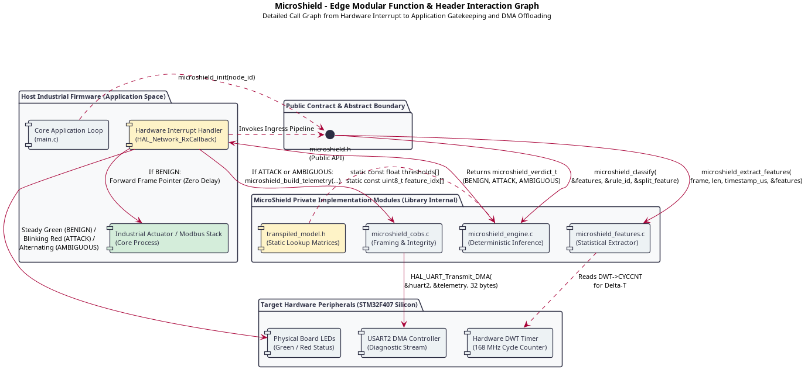
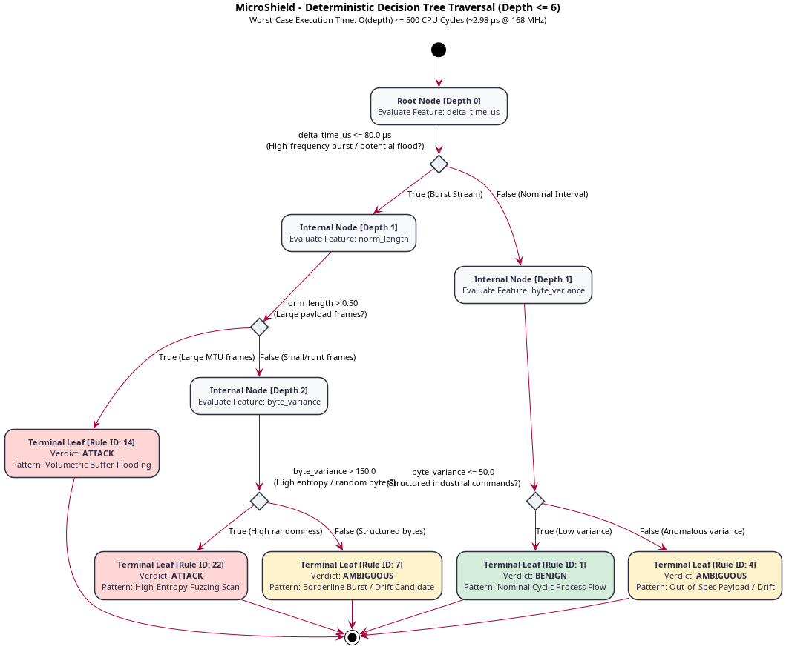
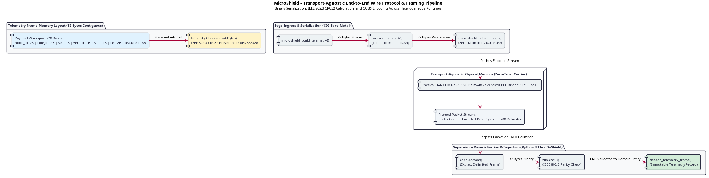

# 3. Architectural & Detailed Design

## 3.1 Architectural Style & Component Decoupling

The design phase formalizes the Solution Domain: the structural, behavioral, and infrastructural patterns chosen to satisfy operational constraints while maintaining independence from low-level implementation libraries.

MicroShield partitions operational responsibilities across two distinct environments:
* **Edge Tier:** A hard real-time, resource-constrained bare-metal microcontroller.
* **Supervisory MLOps Tier:** An asynchronous supervisory telemetry workstation.

### 3.1.1 Evaluation of Candidate Architectural Styles

To establish an optimal architectural pattern, four classical software paradigms were systematically evaluated against the operational constraints:

| Architectural Style | Theoretical Foundation & Mechanics | Suitability for Edge Runtime | Rejection Rationale & Failure Modes |
| :--- | :--- | :--- | :--- |
| **Strictly Layered** | Hierarchical layers; requests traverse sequentially (Hardware -> Driver -> Protocol -> Security -> Application). | Rejected | Deep function-call chains. Incurs register spills (push/pop of R0-R3, R12, LR) and pipeline stalls, violating the sub-50 µs budget. |
| **Shared Dataspace (Blackboard)** | Decoupled components communicate via a central shared memory pool using structured tuples. | Rejected | Requires mutual exclusion (mutexes, spinlocks). Without an RTOS, locking risks priority inversion and non-deterministic jitter. |
| **Microkernel (Plug-in)** | Minimal core executes basic hardware mediation; extended modules load dynamically. | Rejected | Relies on dynamic linking, relocation tables, and virtual memory page mapping, unavailable on Cortex-M lacking an MMU. |
| **Hexagonal (Ports & Adapters)** | Core domain logic isolated at center; communicates via abstract Ports; hardware interacts via boundary Adapters. | **Adopted** | Pure C99 logic decoupled from registers. Enables desktop unit testing with mocks and native compilation on bare-metal hardware. |

### 3.1.2 The Edge Hexagonal Architecture (Ports & Adapters)

At the Edge Runtime Tier, MicroShield implements Cockburn's Hexagonal Architecture pattern to enforce decoupling between detection logic and silicon hardware:

* **Hexagonal Domain Core:** Contains portable C99 algorithmic logic. Performs statistical feature extraction and traverses pre-compiled decision tree matrices. Possesses zero awareness of hardware registers or vendor HAL definitions.
* **Frame Ingress Port:** Formal interface through which incoming data-link frames are injected into the pipeline via static pointers.
* **Gatekeeping Port:** Outbound interface signaling the application firmware whether an intercepted frame is benign (forwarded immediately) or anomalous (quarantined and suppressed).
* **Telemetry Egress Port:** Outbound interface offloading anomaly descriptors to serial transmission buffers without blocking execution.

### 3.1.3 Supervisory Event-Driven Pipeline Architecture

On the host workstation, the supervisory tier is structured as an asynchronous event-driven processing pipeline:

* **Serial Ingestion Daemon:** Manages non-blocking reads from the virtual COM port (VCP), reconstructs framed packets, and enqueues parsed payloads into an in-memory ring buffer.
* **Concept Drift Analyzer:** Evaluates statistical ambiguity distributions across sliding temporal windows using a pluggable Strategy pattern.
* **AST Decision Tree Transpiler:** Consumes scikit-learn tree estimators, validates structural depth constraints, and emits optimized C99 header files.
* **Interactive Operations UI:** A reactive web console built with Dash and Plotly visualizing network flow analytics, confusion matrices, and audit logs.

### 3.1.4 Component Decomposition & Architectural Responsibilities

The functional boundaries and interaction points between the edge and supervisory tiers are illustrated below:

| Component Identifier | Hosting Tier | Primary Engineering Responsibility | Interface Contract & Coupling |
| :--- | :--- | :--- | :--- |
| **Statistical Feature Extractor** | Edge (C99) | Calculates normalized length, inter-arrival time delta, protocol flags, and payload byte variance. | Coupled only to static frame buffers; zero dynamic allocation. |
| **Transpiled Decision Logic** | Edge (C99) | Evaluates extracted feature vectors via static lookup arrays; returns ternary verdict in bounded time. | Constant-time traversal; consumes transpiled_model.h. |
| **COBS Framing Adapter** | Edge (C99) | Encodes diagnostic alert structures using COBS and computes CRC32 checksums. | Operates over dedicated DMA-backed transmission buffers. |
| **Serial Ingestion Daemon** | Supervisory (Python) | Deserializes byte streams, verifies CRC32 integrity, and instantiates immutable TelemetryRecord objects. | Non-blocking OS serial interface; producer for the telemetry queue. |
| **Concept Drift Analyzer** | Supervisory (Python) | Evaluates rolling ambiguity ratios; triggers alerts when ambiguous classifications exceed 5%. | Implements AbstractDriftDetector Strategy interface. |
| **AST Model Transpiler** | Supervisory (Python) | Generates static C99 decision lookup arrays and rule boundaries from trained Python estimators. | Consumes DecisionTreeClassifier; outputs C header syntax. |
| **Interactive Dashboard** | Supervisory (Python) | Visualizes telemetry streams, alerts, and system health in a web browser interface. | Consumes domain state; isolated from ingestion threads. |

### 3.1.5 Theoretical Background: Mathematical Justification of the 4D Feature Space

Deep Packet Inspection (DPI) on resource-constrained microcontrollers fails due to memory exhaustion (stateful TCP reassembly exceeds 192 KB SRAM), timing non-determinism (regex matching exhibits variable latency), and cryptographic blindness (payloads are encrypted under TLS/DTLS).

MicroShield builds upon empirical evidence from benchmark corpora:
* **The Bot-IoT Corpus:** Proved that over 98% of volumetric botnet attacks can be identified through statistical flow dynamics and temporal relationships without payload inspection [6].
* **The Edge-IIoTset Corpus:** Demonstrated that in industrial protocols (Modbus, Ethernet/IP), malicious anomalies distort packet geometry and byte dispersion away from deterministic baseline distributions [7].

From this foundation, MicroShield synthesizes a 4-Dimensional Orthogonal Feature Space extracted in constant time:

| Feature | Symbol | Technical Extraction Description | Discriminative Power & Targeted Vectors |
| :--- | :--- | :--- | :--- |
| **f0** | L_norm | Normalized Frame Length: packet byte size saturated to MTU (1500 bytes) and mapped linearly to [0.0, 1.0]. | Distinguishes fixed-size industrial messages from runt flooding packets and large saturation frames. |
| **f1** | delta_t | Inter-Arrival Time Delta (µs): microsecond interval between contiguous packets via the DWT cycle counter. | Identifies high-rate line floods (delta_t < 50 µs) against periodic nominal industrial control cycles. |
| **f2** | P_flags | Normalized Protocol Flags: normalized composite bitmask capturing transport and data-link control states. | Detects TCP SYN floods and reconnaissance sweeps with abnormal flag combinations. |
| **f3** | sigma^2 | Two-Pass Payload Byte Variance: statistical dispersion of raw payload byte values across the frame. | Separates low-entropy structured industrial commands from high-entropy fuzzing sweeps and encrypted exploits. |

#### Deterministic Tree Traversal: Bounded O(depth) Evaluation

Once the feature vector v = [f0, f1, f2, f3] is populated, the edge engine executes inference by traversing a pre-compiled decision tree:

* Worst-Case Execution Time (WCET) is strictly bounded by tree depth: WCET = O(depth) <= 6 comparisons <= 500 CPU cycles (approx. 2.98 µs @ 168 MHz).
* At each non-terminal node, the MCU performs a single comparison against a pre-compiled threshold and branches to the left or right child array index.
* Terminal leaves resolve two outputs:
  * A ternary classification verdict: VERDICT_BENIGN (0), VERDICT_ATTACK (1), or VERDICT_AMBIGUOUS (2).
  * An immutable 16-bit rule_id identifying the exact leaf node responsible for the decision.

### 3.1.6 Intrinsic Explainable AI (XAI) Architecture

Unlike black-box machine learning approaches that require compute-intensive post-hoc frameworks (e.g., SHAP, LIME), MicroShield delivers native, zero-cost Intrinsic Explainable AI (XAI):

* **On-Chip Symbolic Attribution:** Each leaf node in the transpiled C99 decision tree is assigned an immutable 16-bit integer identifier (rule_id). When the inference engine reaches a terminal leaf, it captures the rule_id and the primary feature index responsible for the split. This metadata is packed directly into the telemetry frame with zero computational overhead.
* **Supervisory Semantic Decoding:** The Python transpiler generates a companion semantic registry (rule_dictionary.json). When the supervisory dashboard receives an anomaly event with rule_id = 14, it maps the identifier directly to human-readable symbolic logic (e.g., "Flagged as ATTACK: byte_variance > 0.45 AND delta_time_us < 120 (Volumetric Flood Pattern)").

---

## 3.2 Distributed Infrastructure & Communication Topologies

### 3.2.1 High-Level Central-Star Diagnostic Topology

MicroShield establishes a Central-Star Diagnostic Architecture. While field devices participate in diverse operational network topologies (RS-485 factory buses, industrial Ethernet rings), each MicroShield-enabled node maintains a dedicated, out-of-band diagnostic link routed directly to the supervisory management station.

This decoupled topology ensures that diagnostic telemetry traffic generated during cyberattacks cannot saturate or introduce communication jitter into the operational control network.

### 3.2.2 Execution Environments & Physical Deployment

* **Edge Node Platform (STM32F407RE):**
  * Core: ARM Cortex-M4 32-bit RISC with single-precision FPU @ 168 MHz.
  * Memory: 512 KB Flash for code and constant lookup tables; 192 KB total SRAM (112 KB System SRAM, 16 KB Auxiliary SRAM, 64 KB CCM Data RAM).
  * Isolation: CCM RAM is reserved for the IDS workspace, bypassing the shared AHB bus matrix to eliminate contention with CPU instruction fetching and DMA transfers.
* **Supervisory Station Platform (Industrial Workstation):**
  * Architecture: x86-64 multi-core processor running Linux.
  * Runtime: CPython 3.11+ leveraging NumPy and Plotly Dash.

### 3.2.3 Selection of Edge Diagnostic Physical Interface

USART was adopted: operating asynchronously in full-duplex mode, USART allows the microcontroller to initiate diagnostic frame transfers autonomously via peripheral interrupts and DMA channels. It translates directly to USB Virtual COM Ports (VCP) for local testbenches, differential RS-485 for long factory runs, or wireless bridge modules without firmware driver modifications.

### 3.2.4 Open Systems Interconnection (OSI) Stack Placement

| OSI Layer | Protocol Examples in Scope | MicroShield Operational Role & Boundary |
| :--- | :--- | :--- |
| **Layer 7 - Application** | Modbus/TCP, MQTT, CoAP, CIP | Consumed by core application firmware; unparsed by MicroShield to avoid deep inspection overhead. |
| **Layer 4 - Transport** | TCP, UDP | Header parsing bypassed; transport dynamics observed indirectly via flow properties. |
| **Layer 3 - Network** | IPv4, IPv6, 6LoWPAN | IP header length and variation evaluated via statistical extraction. |
| **Layer 2 - Data-Link** | Ethernet MAC, CAN, SLIP/COBS | **INLINE BUMP-IN-THE-WIRE BOUNDARY:** Real-time feature calculation and ternary decision tree classification. |
| **Layer 1 - Physical** | 10/100 Ethernet PHY (RMII), RS-485 | Hardware signal acquisition via dedicated peripheral interrupt service routines (ISRs). |

### 3.2.5 Physical Framing & Data Integrity Protocol (COBS + CRC32)

Serial links lack intrinsic frame boundaries. MicroShield implements Consistent Overhead Byte Stuffing (COBS) paired with a trailing Cyclic Redundancy Check (CRC32):
* **Delimiter Independence:** A null byte (0x00) is reserved exclusively as the end-of-frame packet delimiter.
* **Deterministic Overhead:** COBS encodes payload bytes such that raw null bytes within telemetry records are replaced with offset pointers, guaranteeing an overhead bounded by at most 1 byte per 254 bytes of payload.
* **Transmission Integrity:** Every telemetry frame concludes with an IEEE 802.3 compliant 32-bit CRC. The supervisory ingestion daemon validates the checksum prior to allocating domain objects, discarding corrupted frames caused by industrial line noise.

---

## 3.3 Domain-Driven Design (DDD) Modelling

### 3.3.1 Bounded Context Formalization & Ubiquitous Language

The problem domain is segregated into three autonomous Bounded Contexts:

| Bounded Context | Governing Persona | Operational Boundary & Purpose | Ubiquitous Vocabulary |
| :--- | :--- | :--- | :--- |
| **Edge Detection Context** | Firmware Engineer | Real-time packet interception, feature normalization, and deterministic ternary inference bare-metal on the MCU. | RawFrame, FeatureVector, ClassificationVerdict, RuleDescriptor, RingBuffer, StaticLookupMatrix. |
| **Supervisory MLOps Context** | OT Security Engineer | Telemetry stream ingestion, sliding-window drift tracking, model retraining triggers, and automated C99 code generation. | AnomalyRecord, AmbiguityRatio, ConceptDrift, RollingWindow, TranspilationPipeline, ASTNode. |
| **Compliance & Audit Context** | Plant Manager | Forensic logging, incident reconstruction, uptime monitoring, and automated CRA/NIS 2 compliance reporting. | AuditTrail, ForensicEvidence, NonRepudiationHash, IncidentReport, CRAArticle10Compliance. |

### 3.3.2 Domain Concepts & Structural Classification

1. **Edge Detection Context (C99):**
   * *Value Objects:* RawFrame, FeatureVector, ClassificationVerdict, RuleDescriptor.
   * *Aggregate Root:* DetectionEngine (governs static circular reception buffers and enforces state transitions).
   * *Domain Events:* FrameIntercepted, FrameQuarantined, TelemetryEmitted.
2. **Supervisory MLOps Context (Python):**
   * *Entities:* AnomalyRecord (identified by UUID, UTC timestamp, and NodeID).
   * *Aggregate Root:* FleetDriftTracker (governs sliding temporal history of received classifications).
   * *Domain Services:* ASTTranspilerService, DriftEvaluationService.
   * *Domain Events:* ConceptDriftDetected, ModelRetrained, TranspilationCompleted.
3. **Compliance & Audit Context:**
   * *Entities & Repositories:* SecurityIncident, IForensicEvidenceRepository.
   * *Domain Events:* CRAIncidentReported.

---

## 3.4 Structural & Object-Oriented Modelling

### 3.4.1 Supervisory Tier Architecture (Python 3.11+)

The supervisory software applies standard object-oriented design patterns:
* **Strategy Pattern:** `AbstractDriftDetector` defines the evaluation contract (`record_verdict()`, `is_drift_detected()`), implemented by `DriftDetector`.
* **Immutable Domain Objects:** Ingestion payloads are deserialized directly into immutable dataclasses (`frozen=True`), ensuring thread safety across dashboard and analytics threads.
* **Visitor Pattern:** `DecisionTreeTranspiler` traverses the scikit-learn tree structure, extracting matrices without coupling model evaluation logic to C source generation.

### 3.4.2 Edge Runtime Architecture (C99 Bare-Metal)

* **Encapsulation via Translation Units:** Internal state variables are marked `static` within `microshield_engine.c`. External callers interact exclusively through opaque function signatures defined in `microshield.h`.
* **Elimination of Dynamic Dispatch:** Function pointers inside structs (vtables) are excluded from the fast path. All classification calls resolve at link-time as direct branches (BL instructions) to prevent pipeline stalls.
* **Fast-Path Memory Layout: Natural 32-Bit Alignment:** The feature vector struct (`microshield_features_t`) strictly enforces 4-byte natural alignment across all fields (four 32-bit single-precision floats, 16 bytes total). On the ARM Cortex-M4 architecture, 32-bit aligned memory addresses allow the core and the hardware Floating Point Unit (FPU) to perform single-cycle loads and stores (`LDR`, `VLDR`) without incurring bus wait-states, unaligned access penalties, or compiler padding bytes. This minimal cycle consumption directly shortens active execution time ($t_{\text{active}}$).
* **Slow-Path Memory Layout: Explicit Byte Packing:** In contrast to the feature vector, the diagnostic telemetry struct (`microshield_telemetry_t`) is qualified with `__attribute__((packed))`. This directive eliminates all internal compiler padding across heterogeneous data types (integers, bytes, floats), collapsing the memory footprint to exactly 32 contiguous bytes. Because telemetry traverses an asynchronous serial link (Slow Path), absolute cross-platform binary reproducibility between the C runtime and the host Python deserializer (`struct.unpack`) takes precedence over single-cycle memory alignment.

### 3.4.3 Distributed Mapping of Domain Concepts

| Domain Concept | Software Data Type | Runtime Hosting Environment | Concurrency & Access Model |
| :--- | :--- | :--- | :--- |
| **RawFrame** | RawFrame_t (C99 struct) | Edge SRAM (CCM Data RAM) | Single-producer (DMA ISR), single-consumer (Engine). Zero-copy access via pointers. |
| **FeatureVector** | FeatureVector_t (C99 struct) | Edge Stack Frame | Allocated strictly on stack; natural 32-bit alignment; lifetime confined to single-packet inspection. |
| **TelemetryFrame** | TelemetryFrame_t (Packed C99) | Edge TX Ring Buffer | Written by IDS engine on anomaly; packed without padding; read by UART DMA controller. |
| **TelemetryRecord** | TelemetryRecord (Python dataclass) | Supervisory Heap | Immutable; shared concurrently across ingestion, drift monitor, and dashboard threads. |
| **DriftDetector** | DriftDetector (Python class) | Supervisory Process | Evaluated on packet arrival within the ingestion worker thread. |

---

## 3.5 Dynamic Interaction Modelling

### 3.5.1 The Real-Time Fast Path (Inline Gatekeeping)

The fast path executes on every inbound data-link frame. Worst-Case Execution Time (WCET) is strictly bounded: delta_t_IDS <= 50 µs.

1. **Interrupt Ingress (<= 5 µs):** The hardware ISR captures the frame pointer directly from the DMA buffer without memory copying.
2. **Feature Extraction (<= 18 µs):** The statistical extractor calculates normalized length, inter-arrival time delta, protocol flags, and payload byte variance.
3. **Decision Tree Evaluation (<= 12 µs):** The feature vector traverses the static decision matrix in bounded O(depth) time.
4. **Deterministic Gatekeeping (<= 5 µs):** If BENIGN, the frame pointer is passed to the application queue. If ATTACK or AMBIGUOUS, the payload is suppressed.
5. **Telemetry Buffer Staging (<= 4 µs):** For non-benign frames, an alert descriptor is copied into a static ring buffer, and the CPU returns immediately to primary tasks.

### 3.5.2 The Asynchronous Slow Path (Telemetry Offload)

Alert records staged in the internal transmission buffer are drained by the USART DMA controller operating in circular mode at 115200 baud, ensuring physical serial delays never introduce jitter into packet inspection.

---

## 3.6 Behavioural Modelling

### 3.6.1 Edge Engine Finite State Machine & Hardware Visual Signaling

| State Identifier | State Nature | Visual Indicator | Entry Trigger & Operational Behavior | Exit Condition |
| :--- | :--- | :--- | :--- | :--- |
| **STATE_IDLE_SLEEP** | Quiescent (Low Power) | LEDs Off / Prior State | Core sleeps in WFI mode. Peripheral clocks remain gated. | Hardware RX interrupt from communication peripheral. |
| **STATE_FRAME_INGRESS** | Real-Time Transient | Processing | Validates minimum frame bounds (>= 14 bytes). Captures microsecond DWT timestamp. | Runt frame rejected -> IDLE; Valid frame -> FEATURE_EXTRACTION. |
| **STATE_FEATURE_EXTRACTION** | Active Computation | Processing | Executes two-pass byte variance and calculates inter-arrival delta. | Feature vector populated -> DECISION_EVALUATION. |
| **STATE_DECISION_EVALUATION** | Deterministic Inference | Processing | Evaluates static threshold arrays. Resolves leaf rule ID and ternary verdict. | Traversal completes -> GATEKEEPING_ACTION. |
| **STATE_GATEKEEPING_ACTION** | Boundary Control | Steady Green LED | Benign packet: hand off pointer to application queue. Zero field actuation delay. | Returns immediately to STATE_IDLE_SLEEP. |
| **STATE_GATEKEEPING_ACTION** | Boundary Control | Steady Red LED | Malicious packet: suppress frame, increment drop counter, isolate buffers. | Transitions to STATE_TELEMETRY_DISPATCH. |
| **STATE_GATEKEEPING_ACTION** | Boundary Control | Steady Orange LED | Ambiguous packet: suppress frame, flag borderline anomaly for review. | Transitions to STATE_TELEMETRY_DISPATCH. |
| **STATE_TELEMETRY_DISPATCH** | Asynchronous Egress | Maintained Anomaly | Serializes TelemetryFrame_t, computes CRC32, encodes COBS, triggers non-blocking UART DMA push. | Buffer staging completed -> STATE_IDLE_SLEEP. |

### 3.6.2 Supervisory Concept Drift & Retraining Pipeline

On the supervisory workstation, behavior is driven by continuous statistical evaluation across sliding temporal windows. When the rolling ambiguity ratio exceeds 5%, the system flags concept drift and presents the operator with retraining options.

### 3.6.3 Human-in-the-Loop Triaging

When ambiguous telemetry frames arrive, they are staged in a review queue within the dashboard. The operator inspects the intrinsic XAI explanation (split rule, feature values, thresholds) and can validate the sample as benign or confirm an attack. Newly labeled samples feed the retraining corpus, closing the operational feedback loop.

---

## 3.7 Ultra-Low-Power (ULP) Architectural Principles

In industrial battery-backed edge gateways and isolated field instrumentation, energy consumption is as critical as latency determinism. MicroShield adopts an architectural Race-to-Sleep execution model, minimizing the active duty cycle of the core CPU.

### 3.7.1 The Race-to-Sleep Governance Model

The total energy consumed per inspected network packet is governed by:

E_packet = (P_active * t_active) + (P_sleep * t_sleep)

Because the active power consumption of an ARM Cortex-M4 running at 168 MHz (P_active approx. 115 mW) is three orders of magnitude greater than in Low-Power Sleep mode (P_sleep approx. 120 µW with core clock gated via WFI), dynamic energy reduction is achieved strictly by minimizing active execution time (WCET <= 50 µs) rather than down-clocking the core.

### 3.7.2 Software Architectural Optimizations for Low Power

* **Zero-Copy Memory Access:** Eliminates energy-intensive SRAM read-write memory cycles by dereferencing ingress DMA buffers directly.
* **Natural 32-Bit Alignment of Operands:** Aligning the feature structure to 4-byte boundaries ensures that the FPU and ALU load data in single-cycle bus transactions, shaving critical clock cycles off active computation time ($t_{\text{active}}$) before returning to sleep.
* **Non-Volatile Static Lookups:** Mapping decision matrices and CRC tables into Flash .rodata reduces volatile memory refresh and write activity.
* **FPU Throttling via Integer Accumulation:** Using two-pass integer addition for sample mean calculations suppresses floating-point hardware utilization during the first pass.
* **DMA Autonomy:** Transmission of telemetry packets is delegated entirely to the USART DMA controller, allowing the core CPU to re-enter low-power WFI sleep immediately after initiating the transfer.

---

## 3.8 Data-Related Aspects & Storage Architecture

### 3.8.1 Edge Data Storage Architecture (Zero-Heap Allocation)

To eliminate runtime memory fragmentation and prevent non-deterministic allocation latencies, dynamic memory allocation (malloc, calloc, free) is strictly prohibited:
* **Core Coupled Memory (CCM RAM) Allocation:** The feature extraction scratchpad and packet interception rings reside within the 64 KB CCM Data RAM of the STM32F407RE, operating with zero wait-states isolated from peripheral DMA traffic.
* **Static Ring Buffers:** Intercepted packets and pending alerts reside in circular buffers sized as powers of two (2^N), enabling pointer wraparound via bitwise masking without division instructions.
* **Saturation Strategy:** If serial bandwidth saturates, the telemetry buffer overwrites older unread alerts and increments a dropped_telemetry_frames counter, ensuring security logging never halts core industrial tasks.

### 3.8.2 Supervisory Persistence & Forensic Audit Architecture

| Storage Tier | Technology & Format | Retention & Scope | Read/Write Access Patterns |
| :--- | :--- | :--- | :--- |
| **In-Memory Buffer** | Python collections.deque | Rolling window (last 100 observations) | Bounded FIFO updates; accessed by drift calculation thread. |
| **Operational Store** | SQLite 3 (WAL mode) | Historical telemetry and anomaly records | Single-writer daemon; concurrent multi-reader access from UI threads. |
| **Retraining Corpus** | Apache Parquet (ZSTD compression) | Raw feature vectors for model retraining | Batch append during drift events; vectorized column reads during scikit-learn fitting. |

### 3.8.3 Regulatory Compliance & Cryptographic Audit Trails (EU CRA & NIS 2)

Incident records stored in the operational database are protected through cryptographic hash chaining:

Hash_k = SHA256(Record_k || Hash_k-1)

Any retrospective alteration, deletion, or insertion of historical alert records invalidates the hash chain, providing verifiable evidence of tampering during regulatory audits.

---

## 3.9 References

- [1] I. Sommerville, *Software Engineering*, 10th ed. Boston, MA: Pearson, 2016.
- [2] A. Cockburn, "Hexagonal Architecture: Ports and Adapters," *Alistair Cockburn Humans and Technology*, 2005.
- [3] E. Evans, *Domain-Driven Design: Tackling Complexity in the Heart of Software*. Boston, MA: Addison-Wesley, 2004.
- [4] European Commission, "Proposal for a Regulation on horizontal cybersecurity requirements for products with digital elements (Cyber Resilience Act)," COM(2022) 454 final, Brussels, 2022.
- [5] European Parliament and Council of the European Union, "Directive (EU) 2022/2555 on measures for a high common level of cybersecurity across the Union (NIS 2 Directive)," *Official Journal of the European Union*, L 333, pp. 80-152, 2022.
- [6] N. Koroniotis, N. Moustafa, E. Sitnikova, and B. Turnbull, "Towards the Development of Realistic Botnet Dataset in the Internet of Things for Network Forensic Analytics: Bot-IoT Dataset," *Future Generation Computer Systems*, vol. 100, pp. 779-796, 2019.
- [7] M. A. Ferrag, O. Friha, D. Hamouda, L. Maglaras, and H. Janicke, "Edge-IIoTset: A New Comprehensive Realistic Cyber Security Dataset of IoT and IIoT Applications for Centralized and Federated Learning," *IEEE Access*, vol. 10, pp. 40281-40306, 2022.
