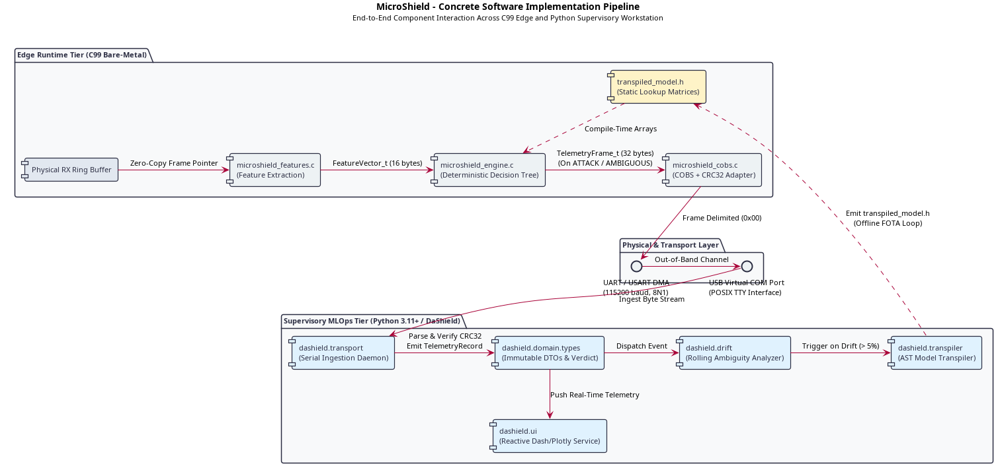

# 4. Implementation & Development

## 4.1 Repository Scaffolding & Polyglot Build Automation

The implementation phase translates the architectural patterns established in the design specification into concrete, verifiable software artifacts. To maintain rigorous separation of concerns while coordinating heterogeneous runtimes, the project repository is partitioned into three autonomous development domains: bare-metal C99 edge firmware, a supervisory Python MLOps suite, and a containerized adversary playback harness.

### 4.1.1 Artifact Directory Layout

The physical directory tree of the software repository (artifact) isolates runtime dependencies, test harnesses, and build scripts into decoupled subsystems:

<pre><code>artifact/
├── Makefile                      # Root polyglot test &amp; build orchestrator
│
├── edge/                         # Bare-Metal C99 Runtime (Taddeo Pallabà)
│   ├── include/                  # Public hexagonal headers and data types
│   ├── src/                      # Zero-heap algorithmic implementations
│   ├── model/                    # Transpiled C99 decision tree lookup matrices
│   ├── tests/                    # Deterministic unit test suites (GCC)
│   └── Makefile                  # Standalone edge compilation harness
│
├── supervisor/                   # Supervisory MLOps Tier: DaShield (Guidotti)
│   ├── pyproject.toml            # Poetry dependency specification &amp; mypy rules
│   ├── dashield/                 # Core Python package
│   │   ├── domain/               # Value objects, Enums, and invariant logic
│   │   ├── transport/            # Non-blocking COBS parser &amp; CRC32 validator
│   │   ├── drift/                # Sliding-window statistical drift detectors
│   │   ├── transpiler/           # AST Decision Tree to C99 matrix compiler
│   │   └── ui/                   # Reactive Dash/Plotly operator dashboard
│   └── tests/                    # Pytest test suite with strict mypy typing
│
└── simulation/                   # Adversary Testbed &amp; Simulation Harness
    ├── whispers/                 # Bot-IoT &amp; Edge-IIoTset traffic playback engine
    └── docker/                   # Dockerfiles and orchestration configurations
</code></pre>

### 4.1.2 Concrete Software Implementation Pipeline

The execution flow bridging real-time packet interception on the microcontroller to supervisory MLOps analytics is realized through a unidirectional data pipeline. Each compilation translation unit and Python module occupies an explicit stage along this processing path (click image to expand to full resolution):

1. **Ingress & Feature Calculation (`microshield_features.c`):** Inbound network frames residing in DMA receive buffers are processed via zero-copy pointer access, extracting the 16-byte `FeatureVector_t` in bounded execution time (&le; 18 &mu;s).
2. **Deterministic Inference (`microshield_engine.c`):** The extracted vector traverses constant lookup matrices defined in `transpiled_model.h`, returning a ternary verdict in bounded time (&le; 12 &mu;s).
3. **Framing & Serial Egress (`microshield_cobs.c`):** Frames classified as `ATTACK` or `AMBIGUOUS` trigger the construction of a 32-byte `TelemetryFrame_t`, protected by an IEEE 802.3 CRC32 checksum and encoded using Consistent Overhead Byte Stuffing (COBS).
4. **Supervisory Parsing (`dashield.transport`):** The supervisory daemon reconstructs incoming frames across the physical serial link, drops corrupted packets, and yields strongly typed domain transfer objects.
5. **Drift Surveillance & Retraining (`dashield.drift` & `dashield.transpiler`):** Validated records feed the rolling ambiguity tracker. When the ratio exceeds 5%, the AST transpiler re-fits the decision tree and emits an updated `transpiled_model.h` for firmware deployment.
6. **Reactive Presentation (`dashield.ui`):** The web console visualizes incoming anomalies and presents borderline cases to human operators for triage.

### 4.1.3 Unified Polyglot Orchestration via Root Makefile

Managing a heterogeneous software repository spanning two completely distinct toolchains—GNU Compiler Collection (GCC) for bare-metal C99 and Poetry for Python 3.11+—introduces workflow friction if commands are not centralized. 

The root `Makefile` establishes a declarative, cross-platform interface exposing standard development targets:

| Make Target | Governed Domain | Underlying Toolchain Action | Target Acceptance Gate |
| :--- | :--- | :--- | :--- |
| `make test-c` | Edge Runtime (C99) | Invokes `edge/Makefile` targeting native GCC with strict flags. | Zero runtime test failures, zero memory leaks. |
| `make test-py` | Supervisory Tier (Python) | Executes `poetry run pytest -v tests/` across all unit suites. | 100% test pass rate for all domain invariants. |
| `make typecheck` | Supervisory Tier (Python) | Runs `poetry run mypy --strict dashield/ tests/`. | Zero type errors, complete PEP 484/526 coverage. |
| `make lint` | Supervisory Tier (Python) | Runs `flake8` and `black --check` across Python modules. | Conformity with PEP 8 styling conventions. |
| `make test` | Full Monorepo | Sequentially runs `test-c`, `test-py`, and `typecheck`. | Universal regression test pass before Git commit. |
| `make clean` | Full Monorepo | Strips compiled `.o` binaries, `__pycache__`, and test cache dirs. | Repository cleaned to pristine source state. |

### 4.1.4 Quality Assurance & Static Verification Gates

To enforce the rigorous standards required by industrial safety-critical software (MISRA C) and academic software engineering methodology, the build pipeline integrates mandatory static verification gates:

#### 1. Bare-Metal C99 Compiler Enforcement (Zero-Warning Policy)
Compilation of edge header contracts and source files enforces strict ISO/IEC 9899:1999 rules:

<pre><code>gcc -std=c99 -Wall -Wextra -Werror -fsyntax-only edge/include/microshield.h</code></pre>

- `-std=c99`: Enforces adherence to the standard C99 specification, eliminating compiler-specific extensions and ensuring portable compilation across ARM GCC, Keil, and IAR toolchains.
- `-Wall` & `-Wextra`: Activates comprehensive compiler warnings, trapping implicit type conversions, unused parameters, and uninitialized structures.
- `-Werror`: Treats all warnings as fatal compilation errors, halting the build pipeline.
- `-fsyntax-only`: Performs full grammatical, lexical, and structural type verification without generating binary code, allowing contract validation during continuous integration.

#### 2. Supervisory Python Static Type Enforcement (`mypy --strict`)
To satisfy the requirements of strictly typed object-oriented software engineering, Python components reject dynamic duck typing in favor of explicit static types managed through Poetry and configured via `pyproject.toml`:
- `strict = true`: Enforces the highest level of static checking, disallowing untyped function definitions, untyped decorators, and implicit optional types.
- `disallow_untyped_defs = true`: Requires explicit type annotations on every function parameter and return value.
- `warn_return_any = true`: Traps and flags any function execution path that could implicitly return an unconstrained `Any` type.
- Value Object Immutability: Enforces domain-driven design principles by wrapping transfer entities in `@dataclass(frozen=True)` and backing categorical states with `IntEnum`, verified through automated unit tests with `pytest`.
