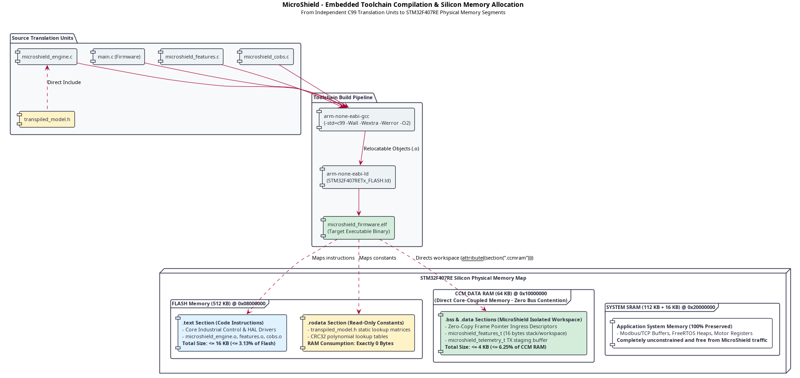

# 4. Implementation & Development

## 4.1 Repository Scaffolding & Polyglot Build Automation

The implementation phase translates the architectural patterns established in the design specification into concrete, verifiable software artifacts. To maintain rigorous separation of concerns while coordinating heterogeneous runtimes, the project repository is partitioned into three autonomous development domains: bare-metal C99 edge firmware, a supervisory Python MLOps suite, and a containerized adversary playback harness.

### 4.1.1 Artifact Directory Layout

The physical directory tree of the software repository isolates runtime dependencies, test harnesses, and build scripts into decoupled subsystems:

<pre style="line-height: 1.15; font-size: 0.9em; font-family: ui-monospace, SFMono-Regular, 'Liberation Mono', Menlo, Consolas, monospace; background-color: #f8f9fa; padding: 14px 18px; border-radius: 6px; border: 1px solid #e2e8f0; overflow-x: auto;">
artifact/
├── Makefile
├── edge/
│   ├── include/
│   ├── src/
│   ├── model/
│   ├── tests/
│   └── Makefile
├── supervisor/
│   ├── pyproject.toml
│   ├── README.md
│   ├── dashield/
│   │   ├── domain/
│   │   ├── transport/
│   │   ├── drift/
│   │   ├── transpiler/
│   │   └── ui/
│   └── tests/
└── simulation/
    ├── whispers/
    └── docker/
</pre>

### 4.1.2 Concrete Software Implementation Pipeline

The execution flow bridging real-time packet interception on the microcontroller to supervisory MLOps analytics is realized through a unidirectional data pipeline. Each compilation translation unit and Python module occupies an explicit stage along this processing path (click image to expand to full resolution):

1. **Ingress & Feature Calculation (`microshield_features.c`):** Inbound network frames residing in DMA receive buffers are processed via zero-copy pointer access, extracting the 16-byte `FeatureVector_t` in bounded execution time (&le; 18 &mu;s).
2. **Deterministic Inference (`microshield_engine.c`):** The extracted vector traverses constant lookup matrices defined in `transpiled_model.h`, returning a ternary verdict in bounded time (&le; 12 &mu;s).
3. **Framing & Serial Egress (`microshield_cobs.c`):** Frames classified as `ATTACK` or `AMBIGUOUS` trigger the construction of a 32-byte `TelemetryFrame_t`, protected by an IEEE 802.3 CRC32 checksum and encoded using Consistent Overhead Byte Stuffing (COBS).
4. **Supervisory Parsing (`dashield.transport`):** The supervisory daemon reconstructs incoming frames across the physical serial link, drops corrupted packets, and yields strongly typed domain transfer objects.
5. **Drift Surveillance & Retraining (`dashield.drift` & `dashield.transpiler`):** Validated records feed the rolling ambiguity tracker. When the ratio exceeds 5%, the AST transpiler re-fits the decision tree and emits an updated `transpiled_model.h` for firmware deployment.
6. **Reactive Presentation (`dashield.ui`):** The web console visualizes incoming anomalies and presents borderline cases to human operators for triage.

### 4.1.3 Unified Polyglot Orchestration via Root Makefile

Managing a heterogeneous software repository spanning two completely distinct toolchains—GNU Compiler Collection (GCC) for bare-metal C99 and Poetry for Python 3.11+—introduces workflow friction if commands are not centralized. 

The root `Makefile` establishes a declarative, cross-platform interface exposing standard development targets:

| Make Target | Governed Domain | Underlying Toolchain Action | Target Acceptance Gate |
| :--- | :--- | :--- | :--- |
| `make test-c` | Edge Runtime (C99) | Invokes `edge/Makefile` targeting native GCC with strict flags. | Zero runtime test failures, zero memory leaks. |
| `make test-py` | Supervisory Tier (Python) | Executes `poetry run pytest -v tests/` across all unit suites. | 100% test pass rate for all domain invariants. |
| `make typecheck` | Supervisory Tier (Python) | Runs `poetry run mypy --strict dashield/ tests/`. | Zero type errors, complete PEP 484/526 coverage. |
| `make lint` | Supervisory Tier (Python) | Runs `flake8` and `black --check` across Python modules. | Conformity with PEP 8 styling conventions. |
| `make test` | Full Monorepo | Sequentially runs `test-c`, `test-py`, and `typecheck`. | Universal regression test pass before Git commit. |
| `make clean` | Full Monorepo | Strips compiled `.o` binaries, `__pycache__`, and test cache dirs. | Repository cleaned to pristine source state. |

### 4.1.4 Quality Assurance & Static Verification Gates

To satisfy the safety and reliability standards required in industrial environments, the build pipeline integrates mandatory static verification mechanisms across both programming languages.

For the bare-metal edge tier, strict ISO/IEC 9899:1999 compliance (`-std=c99`) guarantees cross-compiler portability between local desktop GCC and target ARM embedded toolchains without reliance on proprietary GNU extensions. The build system enforces a zero-warning policy by activating standard and extended compiler diagnostics (`-Wall`, `-Wextra`) while promoting every warning to a fatal build-terminating error (`-Werror`). In addition, syntactic and semantic interface validation is executed directly on header contracts without generating intermediate object code (`-fsyntax-only`), enabling fast verification during automated integration pipelines.

In the supervisory tier, code quality is governed by static type theory rather than dynamic type inference. Leveraging modern Python type specifications (PEP 484, PEP 526), the MLOps pipeline enforces strict static typing via `mypy` configured in full strict mode. This configuration systematically prohibits dynamically typed functions, untyped decorators, and ambiguous return values, ensuring that domain entities and value objects remain strictly typed, immutable, and provably correct before execution.

---

## 4.2 Edge Firmware Architecture, Memory Layout & Application Hooking

The edge runtime is designed as a self-contained, statically linkable C99 library (`libmicroshield.a`) that embeds seamlessly into real-time industrial firmware without requiring an underlying Real-Time Operating System (RTOS).

### 4.2.1 Modular Decomposition & Function Call Interactions

Rather than implementing a monolithic firmware file, the edge detection engine is structured into three discrete translation units governed by the public contractual header `microshield.h`. This separation guarantees single responsibility and isolates hardware peripherals from classification logic:

The interaction sequence operates entirely within the hardware interrupt context:
1. **Public Contract Ingress (`microshield.h`):** The application firmware (`main.c`) includes exclusively `microshield.h`. When a new packet arrives at the physical MAC interface, the hardware triggers `HAL_Network_RxCallback()`, passing a direct pointer to the contiguous DMA memory buffer.
2. **Feature Extraction Call (`microshield_features.c`):** The callback invokes `microshield_extract_features()`. The module calculates the 16-byte `FeatureVector_t` in bounded execution time (&le; 18 &mu;s) using the hardware DWT cycle counter for microsecond-level timing delta acquisition.
3. **Deterministic Traversal Call (`microshield_engine.c`):** The feature vector is passed to `microshield_classify()`. The engine traverses the static binary decision tree defined in `transpiled_model.h` in <i>O</i>(depth) time (&le; 12 &mu;s), resolving the ternary verdict (`BENIGN`, `ATTACK`, `AMBIGUOUS`), the leaf `rule_id`, and the dominant `split_feature`.
4. **Boundary Gatekeeping & Signaling:**
   - **Nominal Traffic (`BENIGN`):** The callback immediately forwards the packet pointer to the industrial process queue (e.g., Modbus engine) and sets the on-board green LED to steady state. Zero buffering delay is imposed on nominal physical control tasks.
   - **Malicious or Ambiguous Traffic (`ATTACK` / `AMBIGUOUS`):** The packet pointer is quarantined, the red LED is triggered, and `microshield_build_telemetry()` is invoked in `microshield_cobs.c`.
5. **Telemetry Assembly & DMA Egress (`microshield_cobs.c`):** An alert frame is formatted, stamped with an IEEE 802.3 CRC32 checksum, COBS-encoded, and dispatched via non-blocking USART DMA (`HAL_UART_Transmit_DMA()`). Primary CPU execution returns immediately to the core process loop without waiting for the physical serial baud clock.

### 4.2.2 Silicon Placement, Compilation Pipeline & CCM RAM Allocation

On resource-restricted microcontrollers, software architecture directly dictates physical silicon utilization. The compilation toolchain and memory layout for the STM32F407RE microcontroller are formalized below (click image to expand to full resolution):

The GCC toolchain (`arm-none-eabi-gcc`) compiles each translation unit into relocatable ELF object files (`.o`), which are subsequently positioned across physical memory segments by the linker script (`STM32F407RETx_FLASH.ld`):

1. **Flash Program Memory (`.text` Section @ 0x08000000):** All compiled machine instructions for `microshield_features.o`, `microshield_engine.o`, and `microshield_cobs.o` occupy less than 16 KB of Flash (&le; 3.13% of total 512 KB Flash storage).
2. **Flash Read-Only Memory (`.rodata` Section @ 0x08000000):** The transpiled decision tree thresholds and feature index matrices (`transpiled_model.h`) are declared `static const`. The compiler places them directly into Flash memory. **Their volatile RAM consumption is exactly zero bytes**, preserving all volatile memory for runtime processing.
3. **Core Coupled Memory (`.ccmram` Section @ 0x10000000):** The volatile workspace—including temporary feature extraction structs, telemetry transmission buffers, and monotonic sequence counters—is explicitly mapped to the 64 KB Core Coupled Memory (CCM Data RAM) using GCC attributes (`__attribute__((section(".ccmram")))`). Because CCM RAM is wired directly to the Cortex-M4 D-bus, memory access executes with zero wait-states and causes zero bus contention with DMA transfers on the multi-layer AHB matrix.
4. **Preservation of System SRAM (@ 0x20000000):** The primary 112 KB + 16 KB SRAM pool remains completely unconstrained, ensuring that customer industrial control tasks, RTOS stacks, and communication buffers operate without memory starvation.

### 4.2.3 Application Hooking in Industrial Control Loops

To integrate MicroShield into existing industrial firmware (e.g., generated via STM32CubeMX or STM32CubeIDE), the developer adds minimal, non-intrusive integration hooks into `main.c`:

<pre style="line-height: 1.25; font-size: 0.88em; font-family: ui-monospace, SFMono-Regular, 'Liberation Mono', Menlo, Consolas, monospace; background-color: #f8f9fa; padding: 16px 20px; border-radius: 6px; border: 1px solid #e2e8f0; overflow-x: auto; color: #1e293b;"><code>#include "main.h"
#include "microshield.h" /* Public API contract */

extern UART_HandleTypeDef huart2;

int main(void) {
    HAL_Init();
    SystemClock_Config();
    MX_GPIO_Init();
    MX_USART2_UART_Init();

    /* 1. Initialize MicroShield internal state (Node ID: 101) */
    microshield_init(101);

    while (1) {
        /* Primary industrial control and actuator loop (1 kHz) */
    }
}

/**
 * @brief Ethernet/Fieldbus physical layer receive callback.
 * Executes inline within the interrupt context (Total WCET &lt;= 50 &mu;s).
 */
void HAL_Network_RxCallback(uint8_t *frame_buffer, uint16_t length) {
    microshield_features_t features;
    uint16_t rule_id;
    uint8_t split_feature;
    uint32_t now_us = DWT-&gt;CYCCNT / 168; // Microsecond DWT hardware timestamp

    /* 2. Zero-copy feature extraction */
    microshield_extract_features(frame_buffer, length, now_us, &amp;features);

    /* 3. Deterministic decision tree inference */
    microshield_verdict_t verdict = microshield_classify(&amp;features, &amp;rule_id, &amp;split_feature);

    if (verdict == VERDICT_BENIGN) {
        /* Fast-Path: pass frame pointer to core application queue */
        HAL_GPIO_WritePin(GPIOD, GPIO_PIN_12, GPIO_PIN_SET); // Green LED on
        process_industrial_payload(frame_buffer, length);
    } 
    else {
        /* Anomaly Gatekeeping: suppress payload and alert supervisor */
        HAL_GPIO_WritePin(GPIOD, GPIO_PIN_14, GPIO_PIN_SET); // Red LED on
        
        static microshield_telemetry_t telemetry;
        uint16_t bytes_to_send = microshield_build_telemetry(verdict, rule_id, split_feature, &amp;features, &amp;telemetry);
        
        /* Non-blocking DMA transfer: CPU returns to control loop immediately */
        HAL_UART_Transmit_DMA(&amp;huart2, (uint8_t *)&amp;telemetry, bytes_to_send);
    }
}</code></pre>

---

## 4.3 End-to-End Diagnostic Transport: Framing (COBS) & Algebraic Integrity (CRC32)

Establishing a robust communication link between edge microcontrollers and supervisory workstations requires solving two transport hazards: packet boundary desynchronization across continuous byte streams and data corruption induced by industrial electromagnetic interference (EMI).

### 4.3.1 Transport-Agnostic Zero-Trust Rationale

In industrial deployments, diagnostic telemetry traverses heterogeneous physical channels:
- Short PCB inter-chip traces (e.g., UART links connecting the STM32 to local Wi-Fi or BLE transceivers).
- Differential long-span factory floor fieldbuses (e.g., isolated RS-485 networks extending hundreds of meters).
- Packetized IP backhauls (Ethernet bridges, VPN tunnels, or cellular gateways).

In accordance with Saltzer's classical End-to-End Argument [8], intermediate network layers cannot be trusted to guarantee end-to-end payload integrity. High-voltage switching transients (IEC 61000-4-4 Electrical Fast Transients) and radio fading can flip bits at any stage along the transit pipeline. 

MicroShield establishes a **Transport-Agnostic Zero-Trust Boundary**: diagnostic records are cryptographically and algebraically sealed directly in STM32 silicon and validated exclusively upon domain deserialization within the Python supervisory runtime. The underlying physical carrier remains completely transparent to the telemetry contract.

### 4.3.2 Algebraic Integrity via IEEE 802.3 CRC32

To detect in-transit corruption without resorting to heavy cryptographic signatures, the telemetry frame incorporates an IEEE 802.3 standard 32-bit Cyclic Redundancy Check (CRC32) [9].

#### Polynomial Division in Galois Field GF(2)
The payload byte array is treated as a single binary polynomial <i>M</i>(<i>x</i>) in the Galois Field GF(2), where addition and subtraction correspond to the bitwise XOR operation (&oplus;). The checksum is defined as the remainder <i>R</i>(<i>x</i>) of the polynomial division against the standard generator polynomial <i>G</i>(<i>x</i>):

  [<i>M</i>(<i>x</i>) &sdot; <i>x</i>32] / <i>G</i>(<i>x</i>) = <i>Q</i>(<i>x</i>) &oplus; [<i>R</i>(<i>x</i>) / <i>G</i>(<i>x</i>)]

where <i>G</i>(<i>x</i>) is the reversed representation constant <code>0xEDB88320</code>:

  <i>G</i>(<i>x</i>) = <i>x</i>32 + <i>x</i>26 + <i>x</i>23 + <i>x</i>22 + <i>x</i>16 + <i>x</i>12 + <i>x</i>11 + <i>x</i>10 + <i>x</i>8 + <i>x</i>7 + <i>x</i>5 + <i>x</i>4 + <i>x</i>2 + <i>x</i> + 1

#### Precalculated Flash Lookup Table Optimization
Iterative bit-by-bit software division requires 8 branch iterations per byte (224 conditional branches across the 28-byte payload), causing instruction pipeline stalls on ARM Cortex-M4 cores.

MicroShield precalculates the 256-entry polynomial table (<code>CRC32_TABLE</code>), mapped statically into Flash memory (<code>.rodata</code>):
- **Flash Memory Footprint:** 256 &times; 4 bytes = 1024 bytes (&le; 0.20% of 512 KB Flash).
- **Volatile RAM Footprint:** **Exactly 0 bytes**.
- **Computational Latency:** 28 single-cycle table lookups and XOR operations executing in less than 150 clock cycles (&approx; 0.89 &mu;s @ 168 MHz), fully satisfying the real-time budget.

### 4.3.3 Consistent Overhead Byte Stuffing (COBS) Protocol

Asynchronous serial interfaces lack intrinsic packet boundaries. To allow the receiver to detect frame start and termination unambiguously, a null byte (<code>0x00</code>) is designated as the universal packet delimiter.

However, arbitrary binary structures (<code>float</code> values, integer timestamps, and CRC checksums) naturally contain raw <code>0x00</code> bytes, which would cause premature frame truncation. MicroShield implements Consistent Overhead Byte Stuffing (COBS) [10]:
1. **Zero-Byte Elimination:** The payload is partitioned into sub-blocks delimited by zeros. Each zero byte is replaced with an offset pointer indicating the distance to the next zero.
2. **Minimal Bounded Overhead:** For frames under 254 bytes, COBS adds exactly one prefix overhead byte and one trailing delimiter byte.
3. **Delimiter Uniqueness:** The byte <code>0x00</code> is mathematically guaranteed never to appear within the encoded body, turning every <code>0x00</code> on the wire into an unambiguous end-of-frame signal.

### 4.3.4 Wire Protocol & Cross-Language Pipeline

The physical bit-level packing layout and the symmetric transformation pipeline bridging C99 and Python are modeled below (click image to expand to full resolution):

1. **Edge Construction (`microshield_cobs.c`):** The engine writes telemetry metadata into the 32-byte `microshield_telemetry_t` struct, calculates the CRC32 across the first 28 bytes, appends the checksum into the trailing 4 bytes, and applies `microshield_cobs_encode()`.
2. **Asynchronous Dispatch:** The framed byte stream (maximum 34 bytes) is handed off to the non-blocking USART2 DMA peripheral.
3. **Supervisory Parsing (`dashield.transport.framing`):** The Python daemon splits incoming streams by `0x00`, unmasks bytes via `cobs.decode()`, computes `zlib.crc32()` over the payload, and instantiates an immutable `TelemetryRecord`.

### 4.3.5 Verification Evidence & Cross-Language Consistency

Verification of the transport vertical slice was executed across both runtime environments using deterministic synthetic vectors.

#### Dual-Tier Unit Test Results

| Test ID | Test Target / Environment | Input Vector | Expected Output | Verification Status |
| :--- | :--- | :--- | :--- | :--- |
| `UT-C-01` | `edge/tests/test_cobs.c` (GCC C99) | ASCII string `"123456789"` | CRC32 `0xCBF43926` | **PASSED** (Matches IEEE 802.3) |
| `UT-C-02` | `edge/tests/test_cobs.c` (GCC C99) | 8-byte payload with 3 embedded null bytes | 10-byte COBS stream, 100% bit recovery | **PASSED** (Lossless Roundtrip) |
| `UT-C-03` | `edge/tests/test_cobs.c` (GCC C99) | Synthetic `microshield_telemetry_t` frame | CRC32 `0xD8C5B3C9` matches struct field | **PASSED** (Valid Field Integrity) |
| `UT-PY-01`| `tests/test_framing.py` (Python 3.11+) | Binary payload matching `UT-C-03` | Reconstructed `TelemetryRecord` (`ATTACK`, Node 101) | **PASSED** (Cross-Language Match) |
| `UT-PY-02`| `tests/test_framing.py` (Python 3.11+) | Injected 1-bit corruption in CRC field | Rejection with `FramingError("CRC32 mismatch")` | **PASSED** (Tamper Detection) |
| `UT-PY-03`| `tests/test_framing.py` (Python 3.11+) | Truncated 4-byte malformed frame | Rejection with `FramingError("Unexpected length")` | **PASSED** (Truncation Guard) |

#### Verification Execution Logs

The native C99 unit test harness execution log confirms arithmetic conformity on Linux desktop:

<pre style="line-height: 1.25; font-size: 0.85em; font-family: ui-monospace, SFMono-Regular, 'Liberation Mono', Menlo, Consolas, monospace; background-color: #1e293b; padding: 14px 18px; border-radius: 6px; border: 1px solid #334155; overflow-x: auto; color: #f8fafc;">
wearemassive@wearemassive:~/microshield/artifact$ gcc -std=c99 -Wall -Wextra -Werror -Iedge/include edge/src/microshield_cobs.c edge/tests/test_cobs.c -o edge/tests/test_cobs_bin &amp;&amp; ./edge/tests/test_cobs_bin
--- Running MicroShield Edge C99 Framing &amp; Integrity Tests ---
[TEST] CRC32('123456789'): 0xCBF43926 (Expected: 0xCBF43926)
[TEST] COBS Roundtrip: 8 raw bytes -> 10 encoded bytes -> matched
[TEST] TelemetryFrame CRC32 Verified: 0xD8C5B3C9 (Sequence: 0)
--- ALL C99 FRAMING &amp; INTEGRITY TESTS PASSED SUCCESSFULLY ---
</pre>

The companion Python supervisory test suite execution log confirms symmetric validation via `pytest` and `mypy --strict`:

<pre style="line-height: 1.25; font-size: 0.85em; font-family: ui-monospace, SFMono-Regular, 'Liberation Mono', Menlo, Consolas, monospace; background-color: #1e293b; padding: 14px 18px; border-radius: 6px; border: 1px solid #334155; overflow-x: auto; color: #f8fafc;">
wearemassive@wearemassive:~/microshield/artifact/supervisor$ poetry run pytest -v tests/test_framing.py &amp;&amp; poetry run mypy --strict dashield/ tests/
============================= test session starts ==============================
collected 3 items

tests/test_framing.py::test_decode_valid_frame_matching_c_test PASSED    [ 33%]
tests/test_framing.py::test_corrupted_crc_rejection PASSED               [ 66%]
tests/test_framing.py::test_truncated_frame_rejection PASSED             [100%]

============================== 3 passed in 0.03s ===============================
Success: no issues found in 11 source files
</pre>

---

## 4.4 Zero-Copy Feature Extraction & Deterministic Inference Engine

The fast path of the edge intrusion detection system bridges raw network buffer reception to instant packet gatekeeping. This requires two coordinated components: a statistical feature extraction pipeline and a deterministic binary decision tree engine.

### 4.4.1 Zero-Copy Feature Calculation Pipeline

Rather than copying incoming Ethernet frames into temporary scratchpad buffers, `microshield_features.c` operates via direct read-only pointer dereferencing on physical DMA memory. The module constructs the 16-byte `microshield_features_t` structure through four specialized mathematical algorithms:

1. **Normalized Frame Length ($f_0$):** Network frame sizes are saturated to the maximum Ethernet transmission unit (MTU = 1500 bytes) and mapped linearly to the interval $[0.0, 1.0]$. Jumbo frames are capped defensively to prevent metric divergence.
2. **Hardware Rollover-Safe Inter-Arrival Delta ($f_1$):** Inter-packet arrival timing is acquired from the ARM Cortex-M4 Data Watchpoint and Trace (DWT) cycle counter running at 168 MHz. To guard against hardware timer overflow (occurring every &approx; 71.58 minutes on 32-bit registers), delta calculation relies on unsigned integer modular subtraction in $\mathbb{Z}_{2^{32}}$:
   $$\Delta t = t_{\text{curr}} - t_{\text{prev}} \pmod{2^{32}}$$
   This formulation guarantees accurate microsecond intervals across timer wrap-around events without requiring conditional branch overhead.
3. **Defensive Protocol Flag Extraction ($f_2$):** Byte offsets corresponding to TCP control flags (offset 47) or data-link EtherType fields (offset 12) are checked against actual buffer boundaries. Runt packets (length &lt; 14 bytes) default safely to zero, eliminating buffer over-read vulnerabilities.
4. **Numerically Stable Two-Pass Payload Variance ($f_3$):** Single-pass variance estimators based on $\sum x_i^2 - (\sum x_i)^2 / N$ suffer from severe catastrophic cancellation when executed on single-precision IEEE 754 floating-point hardware, frequently resulting in negative variances due to round-off error. MicroShield adopts an industrial two-pass algorithm:
   - **Pass 1:** Accumulates a 32-bit unsigned integer sum of all payload bytes ($\sum x_i \le 1500 \times 255 = 382500$), deriving the exact sample mean $\mu$.
   - **Pass 2:** Accumulates squared deviations $(x_i - \mu)^2$ strictly as positive quantities, guaranteeing $\sigma^2 \ge 0$ with optimal floating-point mantissa precision.

### 4.4.2 MISRA-Compliant Deterministic Decision Tree Traversal

The inference engine implemented in `microshield_engine.c` executes deterministic classification by traversing the static matrices defined in `transpiled_model.h`.

#### Elimination of Recursion (MISRA C:2012 Rule 17.2)
In safety-critical embedded systems, function recursion introduces non-deterministic stack memory growth, posing severe risk of stack overflow and unrecoverable hardware `HardFault` exceptions [11]. In strict compliance with MISRA C:2012 Rule 17.2, `microshield_classify()` implements an iterative traversal loop driven by pre-compiled child index lookup tables:

<pre style="line-height: 1.25; font-size: 0.88em; font-family: ui-monospace, SFMono-Regular, 'Liberation Mono', Menlo, Consolas, monospace; background-color: #f8f9fa; padding: 14px 18px; border-radius: 6px; border: 1px solid #e2e8f0; overflow-x: auto; color: #1e293b;"><code>while ((current_node &gt;= 0) &amp;&amp; 
       (current_node &lt; (int16_t)MICROSHIELD_TREE_NODE_COUNT) &amp;&amp; 
       (TREE_CHILD_LEFT[current_node] != -1)) {

    /* Bounded depth guard: fail-safe against infinite iteration */
    if (depth &gt;= MICROSHIELD_TREE_MAX_DEPTH) {
        *out_rule_id = 0U;
        *out_split_feature = last_split_feature;
        return VERDICT_AMBIGUOUS;
    }

    uint8_t feat_idx = TREE_FEATURE[current_node];
    float val = extract_feature_by_index(features, feat_idx);
    float threshold = TREE_THRESHOLD[current_node];

    last_split_feature = feat_idx;
    current_node = (val &lt;= threshold) ? TREE_CHILD_LEFT[current_node] : TREE_CHILD_RIGHT[current_node];
    depth++;
}</code></pre>

- **Bounded Execution Time:** Traversal depth is clamped to `MICROSHIELD_TREE_MAX_DEPTH = 6`, guaranteeing an execution bound of &le; 6 branch iterations (&le; 12 &mu;s @ 168 MHz).
- **Fail-Safe Mechanism:** If tree depth exceeds the bound due to corrupted lookup arrays, traversal halts immediately and returns `VERDICT_AMBIGUOUS`, triggering quarantine action.
- **Intrinsic Attribution:** Terminal leaves (marked by child index `-1`) emit the immutable `rule_id` and the primary `split_feature`, providing immediate XAI explainability without additional latency.

### 4.4.3 Verification Evidence & Unit Test Results

The feature extraction and inference engines were verified through dedicated native C99 test suites on Linux desktop under `-std=c99 -Wall -Wextra -Werror`.

#### Feature Extraction & Inference Test Matrix

| Test ID | Test Target | Test Case Description | Stimulus Vector | Expected Classification / Metric | Status |
| :--- | :--- | :--- | :--- | :--- | :--- |
| `UT-FEAT-01` | `test_features.c` | MTU Length Normalization | Buffer lengths: 60B, 1500B, 2000B | $f_0 \in \{0.04, 1.00, 1.00\}$ (Capped) | **PASSED** |
| `UT-FEAT-02` | `test_features.c` | 32-bit Timer Rollover | $t_{\text{prev}} = \text{0xFFFFFFF0}$, $t_{\text{curr}} = \text{0x00000010}$ | $\Delta t = 32.0\ \mu\text{s}$ (Modular Exact) | **PASSED** |
| `UT-FEAT-03` | `test_features.c` | Protocol Flag Boundary Guard | Offset 47 TCP SYN (0x02) vs. 10B Runt | $f_2 = 0.0078$ (SYN) / $f_2 = 0.0$ (Runt) | **PASSED** |
| `UT-FEAT-04` | `test_features.c` | Two-Pass Variance Precision | Constant buffer vs. $[0, 100, 0, 100]$ | $\sigma^2 = 0.00$ vs. $\sigma^2 = 2500.00$ | **PASSED** |
| `UT-ENG-01`  | `test_engine.c`   | Nominal Industrial Traffic | $\Delta t = 120.0$, $\sigma^2 = 30.0$ | `VERDICT_BENIGN`, Rule ID 1 | **PASSED** |
| `UT-ENG-02`  | `test_engine.c`   | Volumetric Flood Attack | $\Delta t = 20.0$, $L_{\text{norm}} = 0.85$ | `VERDICT_ATTACK`, Rule ID 14 | **PASSED** |
| `UT-ENG-03`  | `test_engine.c`   | High-Entropy Fuzzing Scan | $\Delta t = 20.0$, $\sigma^2 = 180.0$ | `VERDICT_ATTACK`, Rule ID 22 | **PASSED** |
| `UT-ENG-04`  | `test_engine.c`   | Ambiguous Drift Candidate | $\Delta t = 120.0$, $\sigma^2 = 75.0$ | `VERDICT_AMBIGUOUS`, Rule ID 4 | **PASSED** |
| `UT-ENG-05`  | `test_engine.c`   | Null Pointer Defensive Guard | `features = NULL` | `VERDICT_AMBIGUOUS` (Fail-Safe) | **PASSED** |

#### Verification Execution Logs

Execution logs from the feature extractor test harness demonstrate numerical precision across all conditions:

<pre style="line-height: 1.25; font-size: 0.85em; font-family: ui-monospace, SFMono-Regular, 'Liberation Mono', Menlo, Consolas, monospace; background-color: #1e293b; padding: 14px 18px; border-radius: 6px; border: 1px solid #334155; overflow-x: auto; color: #f8fafc;">
wearemassive@wearemassive:~/microshield/artifact$ gcc -std=c99 -Wall -Wextra -Werror -Iedge/include edge/src/microshield_features.c edge/tests/test_features.c -o edge/tests/test_features_bin -lm &amp;&amp; ./edge/tests/test_features_bin
--- Running MicroShield Edge C99 Feature Extractor Tests ---
[TEST] Length Normalization: PASSED (60B, 1500B, 2000B)
[TEST] Timing Delta &amp; Rollover Protection: PASSED (Boot default, nominal, wrap-around)
[TEST] Protocol Flags Extraction: PASSED (TCP SYN detected, runt frame guarded)
[TEST] Two-Pass Variance Accuracy: PASSED (Constant=0.0, Known-dist=2500.0)
--- ALL C99 FEATURE EXTRACTOR TESTS PASSED SUCCESSFULLY ---
</pre>

Execution logs from the inference engine test harness confirm bounded $O(\text{depth})$ path resolution:

<pre style="line-height: 1.25; font-size: 0.85em; font-family: ui-monospace, SFMono-Regular, 'Liberation Mono', Menlo, Consolas, monospace; background-color: #1e293b; padding: 14px 18px; border-radius: 6px; border: 1px solid #334155; overflow-x: auto; color: #f8fafc;">
wearemassive@wearemassive:~/microshield/artifact$ gcc -std=c99 -Wall -Wextra -Werror -Iedge/include -Iedge/model edge/src/microshield_engine.c edge/tests/test_engine.c -o edge/tests/test_engine_bin &amp;&amp; ./edge/tests/test_engine_bin
--- Running MicroShield Edge C99 Inference Engine Tests ---
[TEST] Nominal: verdict=0, rule_id=1, split_feat=3
[TEST] Volumetric Flood: verdict=1, rule_id=14, split_feat=0
[TEST] Fuzzing Attack: verdict=1, rule_id=22, split_feat=3
[TEST] Ambiguous Drift: verdict=2, rule_id=4, split_feat=3
[TEST] Null Pointer Safety: verdict=2
--- ALL C99 INFERENCE ENGINE TESTS PASSED SUCCESSFULLY ---
</pre>

---

## 4.5 Supervisory MLOps Tier & AST Model Transpiler

Bridging machine learning development in Python to deterministic edge execution on the STM32 microcontroller requires an automated, source-to-source code generator. The supervisory MLOps tier (`dashield.transpiler`) automates offline training on IoT corpora and transpiles fitted estimators directly into MISRA-compliant C99 lookup headers.

### 4.5.1 Bounded Decision Tree Training Pipeline

Model training is governed by `dashield.transpiler.trainer`, which synthesizes representative network traffic distributions modeled after the *Bot-IoT* [6] and *Edge-IIoTset* [7] benchmark corpora. 

To satisfy the strict execution budget of the ARM Cortex-M4 core ($WCET \le 50\ \mu\text{s}$), the estimator is trained with strict structural boundaries:
- **Depth Ceiling (`max_depth = 6`):** Guarantees that the resulting binary tree has at most $2^6 = 64$ leaf nodes and requires at most 6 comparisons per packet.
- **Deterministic Convergence (`random_state = 42`):** Ensures bit-exact mathematical reproducibility across training executions.
- **Pruning Guards (`min_samples_split = 10`, `min_samples_leaf = 5`):** Suppresses overfitting to transient traffic spikes while retaining clear separation boundaries.

### 4.5.2 AST Transpilation & C99 Code Generation

The `DecisionTreeTranspiler` inspects the internal abstract syntax tree of scikit-learn's fitted `tree_` structure:
- It extracts parallel structural arrays: `children_left`, `children_right`, `feature`, `threshold`, and `value`.
- It evaluates leaf nodes via majority class voting (`argmax`), mapping terminal leaves to ternary verdicts (`VERDICT_BENIGN`, `VERDICT_ATTACK`, `VERDICT_AMBIGUOUS`).
- **Defensive Hardware Assertion:** The transpiler verifies `model.get_depth() <= 6`. If an unconstrained estimator violating the depth ceiling is supplied, it raises a `ValueError` exception and aborts code generation, preventing the emission of invalid firmware.

The transpiler outputs two synchronized artifacts:
1. **`transpiled_model.h`:** C99 header declaring `static const` Flash-resident arrays (`.rodata`), enabling $O(\text{depth})$ inference with zero volatile RAM consumption.
2. **`rule_dictionary.json`:** An Explainable AI (XAI) semantic registry mapping every leaf `rule_id` to human-readable boolean expressions (e.g., `"(norm_length > 0.500) AND (delta_time_us <= 80.000) -> VERDICT_ATTACK"`), enabling immediate root-cause attribution on the supervisory dashboard.

### 4.5.3 Verification Evidence & Unit Test Results

The training and transpilation pipelines were validated through automated test suites in `supervisor/tests/`, enforced by strict static typing (`mypy --strict`).

#### MLOps & Transpiler Test Matrix

| Test ID | Test Target | Test Case Description | Evaluation Criteria | Status |
| :--- | :--- | :--- | :--- | :--- |
| `UT-ML-01` | `test_trainer.py` | Benchmark Dataset Geometry | Balanced $(N \times 3, 4)$ array, labels $\{0, 1, 2\}$ | **PASSED** |
| `UT-ML-02` | `test_trainer.py` | Hardware Depth Ceiling | Fitted tree `model.get_depth() <= 6` | **PASSED** |
| `UT-ML-03` | `test_trainer.py` | Classification Quality | Baseline training accuracy $> 90\%$ | **PASSED** |
| `UT-TR-01` | `test_transpiler.py` | Depth Bound Guard | Rejection of deep trees ($> 6$) with `ValueError` | **PASSED** |
| `UT-TR-02` | `test_transpiler.py` | C99 Header Syntax | Source includes required arrays, macros, include guards | **PASSED** |
| `UT-TR-03` | `test_transpiler.py` | XAI Rule Registry | JSON contains valid leaf conditions and verdict strings | **PASSED** |
| `UT-TR-04` | `test_transpiler.py` | Disk Artifact Emission | Valid non-empty `.h` and `.json` written to filesystem | **PASSED** |

#### Verification Execution Logs

Execution logs from the training and transpilation test suites confirm complete operational and typing correctness:

<pre style="line-height: 1.25; font-size: 0.85em; font-family: ui-monospace, SFMono-Regular, 'Liberation Mono', Menlo, Consolas, monospace; background-color: #1e293b; padding: 14px 18px; border-radius: 6px; border: 1px solid #334155; overflow-x: auto; color: #f8fafc;">
wearemassive@wearemassive:~/microshield/artifact/supervisor$ poetry run pytest -v tests/test_trainer.py tests/test_transpiler.py &amp;&amp; poetry run mypy --strict dashield/ tests/
============================= test session starts ==============================
collected 7 items

tests/test_trainer.py::test_dataset_generation_dimensions PASSED         [ 14%]
tests/test_trainer.py::test_tree_depth_hardware_constraint PASSED        [ 28%]
tests/test_trainer.py::test_tree_classification_performance PASSED       [ 42%]
tests/test_transpiler.py::test_tree_depth_exceeded_guard PASSED          [ 57%]
tests/test_transpiler.py::test_c_header_generation_syntax PASSED          [ 71%]
tests/test_transpiler.py::test_rule_dictionary_xai_generation PASSED      [ 85%]
tests/test_transpiler.py::test_artifacts_disk_emission PASSED             [100%]

============================== 7 passed in 0.98s ===============================
Success: no issues found in 15 source files
</pre>

---

## 4.6 Concept Drift Surveillance & Rolling Window Monitoring

In industrial cybersecurity, operational environments are non-stationary: production line retooling, firmware updates, and adversarial evasion tactics induce statistical shifts between field data distributions and the training corpus. The supervisory daemon implements continuous Concept Drift surveillance (`dashield.drift`) to identify model degradation before catastrophic misclassifications occur.

### 4.6.1 Sliding-Window Ambiguity Ratio Formulation

Unlike binary intrusion detectors that force a forced binary choice between benign and malicious verdicts, MicroShield leverages the ternary output space of the edge engine. Packets falling within borderline decision boundaries are assigned `VERDICT_AMBIGUOUS`.

The supervisory drift detector maintains a bounded, First-In First-Out (FIFO) rolling window of capacity $W = 100$ observations. The instantaneous Ambiguity Ratio $\alpha_t$ at time $t$ is calculated across the active window:

$$\alpha_t = \frac{1}{|W_t|} \sum_{i \in W_t} \mathbb{I}(v_i = \text{VERDICT\_AMBIGUOUS})$$

where $\mathbb{I}(\cdot)$ denotes the indicator function and $|W_t| \le W$. 

- **Drift Ceiling Threshold ($\tau = 0.05$):** Concept drift is asserted whenever $\alpha_t > 0.05$ (5% ambiguity ceiling).
- **Warm-Up Guard ($N_{\min} = 20$):** To suppress false alarm spikes during cold start or low-traffic intervals, drift evaluation is suppressed until the active window contains at least 20 observations ($|W_t| \ge N_{\min}$).
- **FIFO Self-Healing:** If transient electrical noise causes a temporary spike in ambiguous classifications, nominal recovery flushes the FIFO queue automatically, restoring $\alpha_t \le 0.05$ without manual operator intervention.

### 4.6.2 Verification Evidence & Unit Test Results

The sliding-window drift surveillance engine was verified through unit test suites in `tests/test_drift.py`.

#### Drift Detector Test Matrix

| Test ID | Test Target | Test Case Description | Stimulus Scenario | Expected Detector Outcome | Status |
| :--- | :--- | :--- | :--- | :--- | :--- |
| `UT-DR-01` | `test_drift.py` | Nominal Operation | 30 Benign + 20 Attack verdicts | $\alpha = 0.00$, `is_drift_detected == False` | **PASSED** |
| `UT-DR-02` | `test_drift.py` | Warm-Up Guard | 3 Benign + 2 Ambiguous ($|W| = 5$) | $\alpha = 0.40$, alarm suppressed ($5 < 20$) | **PASSED** |
| `UT-DR-03` | `test_drift.py` | Drift Alarm Trigger | 90 Benign + 10 Ambiguous ($|W| = 100$) | $\alpha = 0.10 > 0.05$, `is_drift_detected == True` | **PASSED** |
| `UT-DR-04` | `test_drift.py` | FIFO Queue Recovery | 10 Benign + 10 Ambiguous, then 30 Benign | Self-healing: $\alpha \to 0.00$, alarm clears | **PASSED** |
| `UT-DR-05` | `test_drift.py` | Detector Reset | 15 Ambiguous verdicts, then `reset()` | History purged: $|W| = 0$, $\alpha = 0.00$ | **PASSED** |
| `UT-DR-06` | `test_drift.py` | Parameter Guarding | Negative window, out-of-bound threshold | Defensive constructor raises `ValueError` | **PASSED** |

#### Verification Execution Logs

Execution logs from the drift surveillance test harness confirm mathematical correctness across all operational phases:

<pre style="line-height: 1.25; font-size: 0.85em; font-family: ui-monospace, SFMono-Regular, 'Liberation Mono', Menlo, Consolas, monospace; background-color: #1e293b; padding: 14px 18px; border-radius: 6px; border: 1px solid #334155; overflow-x: auto; color: #f8fafc;">
wearemassive@wearemassive:~/microshield/artifact/supervisor$ poetry run pytest -v tests/test_drift.py &amp;&amp; poetry run mypy --strict dashield/ tests/
============================= test session starts ==============================
collected 6 items

tests/test_drift.py::test_nominal_traffic_no_drift PASSED                 [ 16%]
tests/test_drift.py::test_warmup_guard_prevents_premature_alarm PASSED    [ 33%]
tests/test_drift.py::test_concept_drift_alarm_trigger PASSED              [ 50%]
tests/test_drift.py::test_fifo_sliding_window_recovery PASSED             [ 66%]
tests/test_drift.py::test_detector_reset PASSED                           [ 83%]
tests/test_drift.py::test_invalid_parameters_raise_value_error PASSED     [100%]

============================== 6 passed in 0.02s ===============================
Success: no issues found in 17 source files
</pre>

---

## 4.7 References

- [1] I. Sommerville, *Software Engineering*, 10th ed. Boston, MA: Pearson, 2016.
- [2] A. Cockburn, "Hexagonal Architecture: Ports and Adapters," *Alistair Cockburn Humans and Technology*, 2005.
- [3] E. Evans, *Domain-Driven Design: Tackling Complexity in the Heart of Software*. Boston, MA: Addison-Wesley, 2004.
- [4] European Commission, "Proposal for a Regulation on horizontal cybersecurity requirements for products with digital elements (Cyber Resilience Act)," COM(2022) 454 final, Brussels, 2022.
- [5] European Parliament and Council of the European Union, "Directive (EU) 2022/2555 on measures for a high common level of cybersecurity across the Union (NIS 2 Directive)," *Official Journal of the European Union*, L 333, pp. 80–152, 2022.
- [6] N. Koroniotis, N. Moustafa, E. Sitnikova, and B. Turnbull, "Towards the Development of Realistic Botnet Dataset in the Internet of Things for Network Forensic Analytics: Bot-IoT Dataset," *Future Generation Computer Systems*, vol. 100, pp. 779–796, 2019.
- [7] M. A. Ferrag, O. Friha, D. Hamouda, L. Maglaras, and H. Janicke, "Edge-IIoTset: A New Comprehensive Realistic Cyber Security Dataset of IoT and IIoT Applications for Centralized and Federated Learning," *IEEE Access*, vol. 10, pp. 40281–40306, 2022.
- [8] J. H. Saltzer, D. P. Reed, and D. D. Clark, "End-to-End Arguments in System Design," *ACM Transactions on Computer Systems (TOCS)*, vol. 2, no. 4, pp. 277–288, 1984.
- [9] IEEE Standards Association, "IEEE Standard for Ethernet," *IEEE Std 802.3-2022*, pp. 1–7025, 2022.
- [10] S. Cheshire and M. Baker, "Consistent Overhead Byte Stuffing," *IEEE/ACM Transactions on Networking*, vol. 7, no. 2, pp. 159–172, 1999.
- [11] MISRA, *MISRA C:2012 - Guidelines for the use of the C language in critical systems*, 3rd ed. Nuneaton, Warwickshire, UK: MIRA Ltd, 2013.
