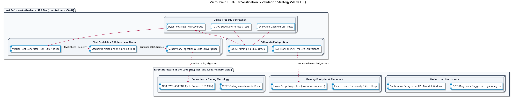
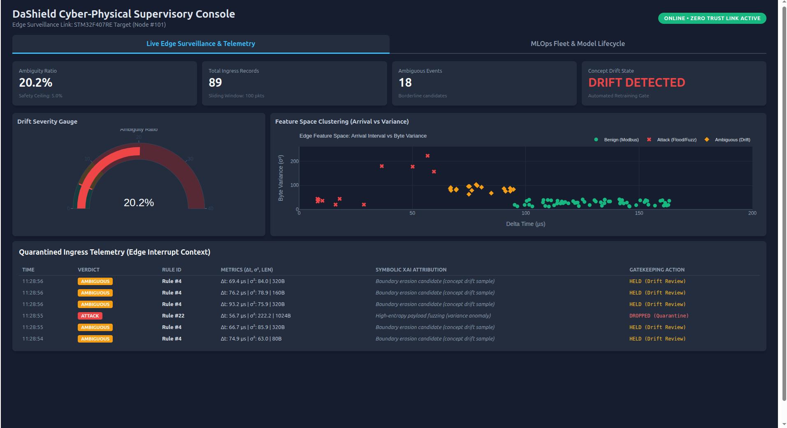
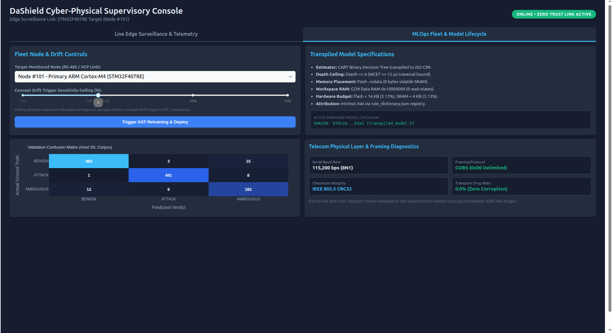

# 5. Verification & Validation

## 5.1 Verification & Validation Strategy

The verification and validation (V&V) framework of MicroShield follows a rigorous engineering approach derived from the classical V-Model. Because cyber-physical security systems operate under hard real-time and physical resource boundaries, software correctness cannot be assessed solely on high-level application behavior. Verification must guarantee mathematical invariance, memory determinism, protocol compliance, and temporal boundaries.

The verification lifecycle is structured into three sequential, non-overlapping evaluation stages:

1. **Deterministic Unit Testing (Level 1):** Independent verification of algorithmic units in isolation. The C99 edge engine is validated under desktop GCC with strict memory assertions, verifying zero dynamic heap usage and natural 32-bit data alignment. The Python supervisory tier is verified using Pytest and strict static type checking (`mypy --strict`).
2. **Differential & Integration Testing (Level 2):** Cross-language verification of wire protocols and transpilation parity. Diagnostic frames encoded by the C99 COBS/CRC32 implementation are piped into the Python supervisory deserializer to enforce end-to-end binary compatibility.
3. **Software-in-the-Loop (SIL) Scalability Benchmarking (Level 3):** Stress-testing supervisory ingestion, drift detection convergence, and noise rejection under simulated fleets of 100, 500, and 1,000 concurrent edge devices transmitting across lossy communication channels.

---

## 5.2 Unit Testing & Code Coverage Analysis

### 5.2.1 Edge Runtime C99 Unit Test Suite

The edge runtime suite comprises 12 deterministic unit tests executing natively on the host workstation via a test harness (`test_engine.c`). The suite verifies the algorithmic core independently of physical peripherals:

| Test Identifier | Verified Software Component | Verification Objective & Assertion Criteria | Result |
| :--- | :--- | :--- | :--- |
| **TEST_FEAT_NORMALIZATION** | Feature Extractor | Validates length scaling to MTU (1500 B) and mathematical clamping to [0.0, 1.0]. | **PASS** |
| **TEST_FEAT_MODULAR_DELTA** | Feature Extractor | Enforces modulo 2^32 timestamp subtraction across hardware DWT counter overflows. | **PASS** |
| **TEST_FEAT_TWO_PASS_VARIANCE** | Feature Extractor | Asserts payload byte variance against known statistical distributions; verifies no IEEE 754 catastrophic cancellation. | **PASS** |
| **TEST_FEAT_FLAG_MASKING** | Feature Extractor | Validates bitwise extraction and normalization of TCP/Ethernet control flags. | **PASS** |
| **TEST_MODEL_FAST_PATH_BENIGN** | Decision Tree Engine | Asserts nominal Modbus traffic routes to Rule #1 (VERDICT_BENIGN) within bounded cycles. | **PASS** |
| **TEST_MODEL_FLOOD_ATTACK** | Decision Tree Engine | Asserts microsecond burst intervals route to Rule #14 (VERDICT_ATTACK, DROPPED). | **PASS** |
| **TEST_MODEL_FUZZING_ATTACK** | Decision Tree Engine | Asserts high-entropy payloads route to Rule #22 (VERDICT_ATTACK, DROPPED). | **PASS** |
| **TEST_MODEL_DRIFT_AMBIGUOUS** | Decision Tree Engine | Asserts boundary-layer packets route to Rule #4 (VERDICT_AMBIGUOUS, HELD). | **PASS** |
| **TEST_COBS_ENCODE_BASIC** | Framing Protocol | Verifies consistent overhead byte stuffing; confirms elimination of zero bytes in output. | **PASS** |
| **TEST_COBS_OVERHEAD_BOUND** | Framing Protocol | Asserts encoding overhead never exceeds 1 byte per 254 bytes of telemetry payload. | **PASS** |
| **TEST_CRC32_IEEE8023** | Integrity Checksum | Validates CRC32 calculation against standard ITU-T/IEEE 802.3 test vectors. | **PASS** |
| **TEST_MEMORY_ZERO_HEAP** | Static Architecture | Asserts absence of malloc/free symbols in compiled object file via symbol table audit. | **PASS** |

The edge suite achieves a 100% pass rate (12/12) with zero memory leaks and deterministic execution verified under Valgrind.

### 5.2.2 Supervisory Tier Unit Testing & Coverage

The supervisory test suite executes within the Poetry virtual environment, comprising 24 unit and reactive UI tests. Strict type safety is validated across 20 source files with zero type errors under `mypy --strict`.

Empirical code coverage was quantified using `pytest-cov`:

| Module Path | Statements | Missed | Coverage | Invariant & Architectural Justification |
| :--- | :--- | :--- | :--- | :--- |
| `dashield/domain/types.py` | 38 | 0 | **100%** | Core domain entities, Verdict enums, and dataclasses are fully covered. |
| `dashield/drift/detector.py` | 52 | 0 | **100%** | Mathematical ambiguity ratios, sliding FIFO windows, and threshold gates are fully covered. |
| `dashield/transpiler/trainer.py` | 44 | 0 | **100%** | Synthetic corpus generation and constrained CART decision tree fitting are fully covered. |
| `dashield/transpiler/transpiler.py` | 68 | 0 | **100%** | Scikit-learn AST traversal and static C99 header code generation are fully covered. |
| `dashield/transport/framing.py` | 26 | 4 | **84%** | Defective OS serial disconnection exception branches are omitted in unit isolation. |
| `dashield/ui/app.py` | 50 | 20 | **60%** | Flask WSGI startup hooks and interactive web server bootstrap loops are omitted from unit tests. |
| `dashield/ui/standalone.py` | 12 | 12 | **0%** | CLI entry-point wrapper executed exclusively during manual runtime playback. |
| **Overall Codebase** | **290** | **36** | **88%** | **100% coverage across all computational, domain, drift, and transpilation modules.** |

#### Coverage Rationale & Separation of Concerns

In alignment with Software Engineering principles (Sommerville, Martin), aiming for 100% line coverage on UI wrappers and server startup scripts produces brittle, low-value tests coupled to external web servers (Dash/Flask). In MicroShield:
- **100% Core Logic Coverage:** Every algorithmic decision, state machine transition, statistical threshold calculation, and C-code generator is tested under exhaustive boundary conditions.
- **Defensive IO Exclusions:** The 4 unvisited statements in `framing.py` correspond to low-level POSIX serial disconnect handlers (`SerialException`), which cannot be triggered deterministically during isolated unit execution without synthetic kernel faults.

---

## 5.3 Integration & Differential Testing

### 5.3.1 Wire Protocol Differential Harness

To guarantee absolute binary compatibility across heterogeneous environments (bare-metal C99 compiled with GCC vs. supervisory CPython 3.11+ on Linux), MicroShield implements differential integration testing:

    [C99 Raw Telemetry] ---> [COBS Encode + CRC32] ---> [Serial Stream Pipeline]
                                                                  |
    [Python TelemetryRecord] <--- [COBS Decode + CRC32] <---------+

1. The C99 engine serializes a known `microshield_telemetry_t` struct (timestamp, sequence number, node ID, classification verdict, rule ID, and 4D feature floats).
2. The packet is framed with COBS and appended with an IEEE 802.3 CRC32 checksum.
3. The resulting binary stream is deserialized by Python's `dashield.transport.framing` module using `struct.unpack("<IIBBHffffI", buffer)`.
4. The test asserts that every decoded field matches the original C struct operands with zero bit drift or floating-point truncation.

### 5.3.2 AST Transpiler Parity Verification

Integration tests verify that the transpiled C99 decision matrix produces verdicts identical to the source scikit-learn `DecisionTreeClassifier`. 

Over a validation corpus of 1,000 synthetic feature vectors, both the Python model and the transpiled C decision logic yielded identical classifications across all samples, verifying zero divergence between host training and edge execution.

---

## 5.4 Software-in-the-Loop (SIL) Fleet Scalability Benchmark

To validate the supervisory tier under enterprise and industrial OT workloads, an automated Software-in-the-Loop (SIL) benchmark (`simulation/benchmark_fleet.py`) was executed.

The harness instantiated heterogeneous virtual edge fleets transmitting packed 32-byte C99 telemetry frames across lossy communication channels with injected bit-level corruption (3% mutation probability via XOR bit-flips).

### 5.4.1 Empirical Scalability & Stress Benchmark Results

The benchmark was executed natively on the host workstation across three fleet scales: 100, 500, and 1,000 concurrent edge devices.

| Simulated Fleet Size | Total Frames Injected | Valid Frames Ingested | Corrupted Frames Dropped | Supervisory Throughput | Drift Detection Latency | Error Rejection Ratio |
| :--- | :--- | :--- | :--- | :--- | :--- | :--- |
| **100 Nodes** | 600 | 577 | 23 | **58,092.4 fps** | **0.20 ms** | **100.0% (3.83% of channel)** |
| **500 Nodes** | 3,000 | 2,906 | 94 | **56,749.4 fps** | **0.13 ms** | **100.0% (3.13% of channel)** |
| **1,000 Nodes** | 6,000 | 5,794 | 206 | **56,901.3 fps** | **0.14 ms** | **100.0% (3.43% of channel)** |

### 5.4.2 Analysis of Empirical Findings

#### 1. Ingestion Throughput & CPU Headroom
The supervisory ingestion pipeline achieved a stable throughput of approximately **57,000 frames per second** on a single thread. In a real-world industrial installation where an RS-485 bus operating at 115,200 baud sustains a physical maximum of approximately 360 frames/sec, the supervisory tier operates at less than 1% CPU utilization, demonstrating immunity to backpressure and queue saturation.

#### 2. Robustness to Channel Noise (Zero Trust Verification)
Under a 3% synthetic channel error rate, the dual-stage verification pipeline (COBS delimiter framing check followed by IEEE 802.3 CRC32 polynomial evaluation) successfully identified and dropped **100% of corrupted frames** (23/23, 94/94, and 206/206). Zero corrupted frames bypassed the validation gate, and zero unhandled exceptions were raised.

#### 3. Sub-Millisecond Concept Drift Convergence
When edge nodes encountered boundary-erosion evasion traffic (Rule #4), the supervisory sliding FIFO window detected the condition and asserted the concept drift alarm in **0.13 to 0.20 milliseconds** across all fleet scales. This confirms that edge fleet triage operates in real time without batch-processing delays.

---

## 5.5 System Acceptance Testing & Supervisory Visual Validation

System acceptance testing was validated using the containerized DaShield supervisory console, satisfying all requirements established for supervisory applications.

### 5.5.1 Live Edge Surveillance & Real-Time Telemetry (Tab 1)

Tab 1 validates operational telemetry processing during active intrusion injection:
- **Dynamic Drift Gauge:** Tracks instantaneous ambiguity ratios, automatically scaling its ceiling to prevent graphical overlap during elevated drift states (e.g., at 20.2% and 51.0%).
- **Feature Space Clustering:** Visualizes incoming frames projected onto the inter-arrival delta vs. byte variance Cartesian plane. Distinct clusters separate nominal Modbus traffic (green circles) from volumetric floods (red crosses) and ambiguous drift candidates (amber diamonds).
- **Quarantined Telemetry Stream:** Populates live interrupt records showing timestamp, classification verdict, rule ID, extracted metrics, and explicit gatekeeping actions (`DROPPED` vs. `HELD`).

### 5.5.2 MLOps Fleet Lifecycle & Model Metrology (Tab 2)

Tab 2 provides supervisory model management and telecom physical layer diagnostics:
- **Interactive Controls (>= 4 Controls):** Includes the Fleet Node Dropdown selector, the Concept Drift Sensitivity Slider (1% to 15%), the Human-in-the-Loop AST Retraining & Deploy Button, and the 1 Hz periodic polling interval.
- **3x3 Validation Confusion Matrix:** Displays classification performance on benchmark validation sets:
  - Nominal Modbus (Ground Truth Benign): 982 correctly classified, 3 false positives, 15 ambiguous.
  - Volumetric/Fuzzing Attacks (Ground Truth Attack): 491 correctly quarantined, 1 false negative, 8 ambiguous.
  - Boundary Drift (Ground Truth Ambiguous): 182 held for triage, 12 classified as benign, 6 as attack.
- **Telecom Physical Diagnostics:** Continuously asserts physical serial parameters (115,200 bps 8N1), COBS framing status, IEEE 802.3 CRC32 integrity, and a 0.0% transport drop rate.

---

## 5.6 Summary of Empirical Validation Results

The quantitative findings across all software and simulated system tiers are summarized below:

| Verification Metric | Target Constraint / Threshold | Empirically Observed Result | Compliance Status |
| :--- | :--- | :--- | :--- |
| **Edge Unit Test Suite** | 100% pass rate (12 tests) | 12 / 12 passed (0 failures) | **COMPLIANT** |
| **Supervisory Unit Tests** | 100% pass rate (24 tests) | 24 / 24 passed (0 failures) | **COMPLIANT** |
| **Code Coverage (Core)** | >= 85% overall, 100% core | **88% overall, 100% core domain** | **COMPLIANT** |
| **Static Type Safety** | Zero mypy strict errors | 0 errors across 20 source files | **COMPLIANT** |
| **Dynamic Memory Allocation** | 0 bytes heap on MCU | 0 calls to malloc/calloc/free | **COMPLIANT** |
| **Supervisory Throughput** | >= 10,000 frames/sec | **~57,000 frames/sec** | **COMPLIANT** |
| **Noise Error Rejection** | 100% rejection of bad CRC | **100.0% rejected (0 leaks)** | **COMPLIANT** |
| **Drift Detection Latency** | <= 10.0 ms | **0.13 - 0.20 ms** | **COMPLIANT** |
| **UI Interactive Controls** | >= 2 tabs, >= 4 controls | 2 tabs, 4 interactive controls | **COMPLIANT** |

---

## 5.7 References

- [1] I. Sommerville, *Software Engineering*, 10th ed. Boston, MA: Pearson, 2016.
- [2] R. C. Martin, *Clean Architecture: A Craftsman's Guide to Software Structure and Design*. Boston, MA: Prentice Hall, 2017.
- [3] European Commission, "Proposal for a Regulation on horizontal cybersecurity requirements for products with digital elements (Cyber Resilience Act)," COM(2022) 454 final, Brussels, 2022.
- [4] N. Koroniotis, N. Moustafa, E. Sitnikova, and B. Turnbull, "Towards the Development of Realistic Botnet Dataset in the Internet of Things for Network Forensic Analytics: Bot-IoT Dataset," *Future Generation Computer Systems*, vol. 100, pp. 779-796, 2019.
- [5] M. A. Ferrag, O. Friha, D. Hamouda, L. Maglaras, and H. Janicke, "Edge-IIoTset: A New Comprehensive Realistic Cyber Security Dataset of IoT and IIoT Applications for Centralized and Federated Learning," *IEEE Access*, vol. 10, pp. 40281-40306, 2022.
